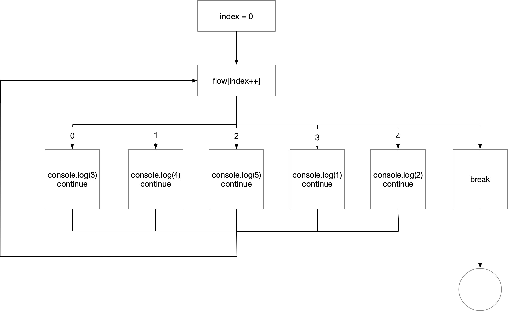
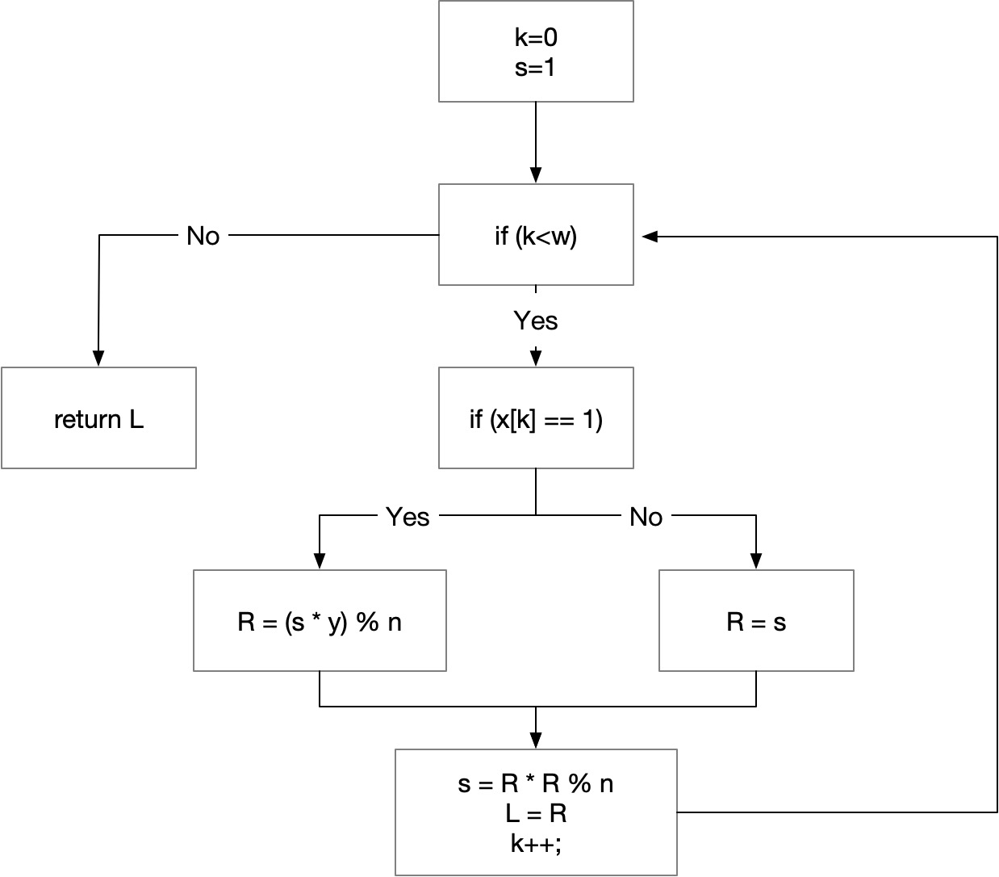
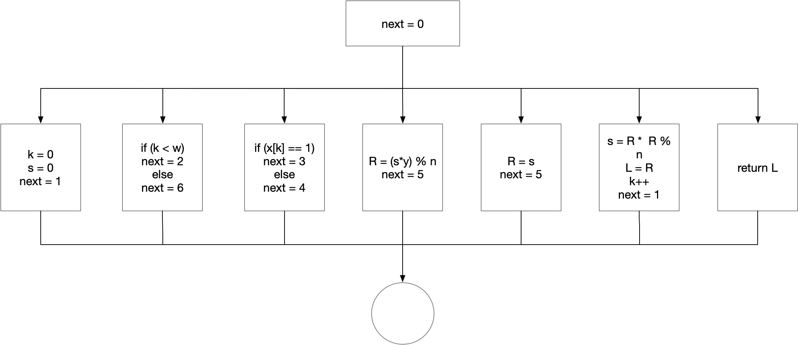

## 前言

在安全攻防战场中，前端代码都是公开的，那么对前端进行加密有意义吗？可能大部分人的回答是，`毫无意义`，不要自创加密算法，直接用HTTPS吧。但事实上，即使不了解密码学，也应知道是`有意义`的，因为`加密前`和`解密后`的环节，是不受保护的。HTTPS只能保护传输层，此外别无用处。

而加密环节又分：

* 传输加密（对抗链路破解）
* 数据加密（对抗协议破解）
* 代码加密（隐藏算法、反调试...）

本文主要列举一些我见到的，我想到的一些加密方式，其实确切的说，应该叫混淆，不应该叫加密。

那么，代码混淆的具体原理是什么？其实很简单，就是去除代码中尽可能多的有意义的信息，比如注释、换行、空格、代码负号、变量重命名、属性重命名（允许的情况下）、无用代码的移除等等。因为代码是公开的，我们必须承认没有任何一种算法可以完全不被破解，所以，我们只能尽可能增加攻击者阅读代码的成本

## 语法树AST混淆

在保证代码原本的功能性的情况下，我们可以对代码的AST按需进行变更，然后将变更后的AST在生成一份代码进行输出，达到混淆的目的，我们最常用的[uglify-js](https://www.npmjs.com/package/uglify-js)就是这样对代码进行混淆的，当然`uglify-js`的混淆只是主要进行代码压缩，即我们下面讲到的变量名混淆。

### 变量名混淆

将变量名混淆成阅读比较难阅读的字符，增加代码阅读难度，上面说的`uglify-js`进行的混淆，就是把变量混淆成了短名（主要是为了进行代码压缩），而现在大部分安全方向的混淆，都会将其混淆成类16进制变量名，效果如下：

```js
var test = 'hello';
```

混淆后：

```js
var _0x7deb = 'hello';
```

注意事项：

1. eval语法，eval函数中可能使用了原来的变量名，如果不对齐进行处理，可能会运行报错，如下：

    ```js
    var test = 'hello';
    eval('console.log(test)');
    ```

    如果不对eval中的console.log(test)进行关联的混淆，则会报错。不过，如果eval语法超出了静态分析的范畴，比如：

    ```js
    var test = 'hello';
    var variableName = 'test';
    eval('console.log(' + variableName + ')');
    ```

    这种咋办呢，可能要进行遍历AST找到其运行结果，然后在进行混淆，不过貌似成本比较高。

2. 全局变量的编码，如果代码是作为SDK进行输出的，我们需要保存全局变量名的不变，比如：

    ```html
    <script>
    var $ = function(id) {
        return document.getElementById(id);
    };
    </script>
    ```

    `$`变量是放在全局下的，混淆过后如下：

    ```html
    <script>
    var _0x6482fa = function(id) {
        return document.getElementById(id);
    };
    </script>
    ```

    那么如果依赖这一段代码的模块，使用`$('id')`调用自然会报错，因为这个全局变量已经被混淆了。

### 常量提取

将JS中的常量提取到数组中，调用的时候用数组下标的方式调用，这样的话直接读懂基本不可能了，要么反AST处理下，要么一步一步调试，工作量大增。

以上面的代码为例：

```js
var test = 'hello';
```

混淆过后：

```js
var _0x9d2b = ['hello'];

var _0xb7de = function (_0x4c7513) {
    var _0x96ade5 = _0x9d2b[_0x4c7513];
    return _0x96ade5;
};

var test = _0xb7de(0);
```

当然，我们可以根据需求，将数组转化为二位数组、三维数组等，只需要在需要用到的地方获取就可以。

### 常量混淆

将常量进行加密处理，上面的代码中，虽然已经是混淆过后的代码了，但是`hello`字符串还是以明文的形式出现在代码中，可以利用JS中16进制编码会直接解码的特性将关键字的Unicode进行了16进制编码。如下：

```js
var test = 'hello';
```

结合常量提取得到混淆结果：

```js
var _0x9d2b = ['\x68\x65\x6c\x6c\x6f'];

var _0xb7de = function (_0x4c7513) {
    _0x4c7513 = _0x4c7513 - 0x0;
    var _0x96ade5 = _0x9d2b[_0x4c7513];
    return _0x96ade5;
};

var test = _0xb7de('0x0');
```

当然，除了JS特性自带的Unicode自动解析以外，也可以自定义一些加解密算法，比如对常量进行base64编码，或者其他的什么rc4等等，只需要使用的时候解密就OK，比如上面的代码用base64编码后：

```js
var _0x9d2b = ['aGVsbG8=']; // base64编码后的字符串

var _0xaf421 = function (_0xab132) {
    // base64解码函数
    var _0x75aed = function(_0x2cf82) {
        // TODO: 解码
    };
    return base64_decode(_0xab132);
}

var _0xb7de = function (_0x4c7513) {
    _0x4c7513 = _0x4c7513 - 0x0;
    var _0x96ade5 = _0xaf421(_0x9d2b[_0x4c7513]);
    return _0x96ade5;
};

var test = _0xb7de('0x0');
```

### 运算混淆

将所有的逻辑运算符、二元运算符都变成函数，目的也是增加代码阅读难度，让其无法直接通过静态分析得到结果。如下：

```js
var i = 1 + 2;
var j = i * 2;
var k = j || i;
```

混淆后：

```js
var _0x62fae = {
    _0xeca4f: function(_0x3c412, _0xae362) {
        return _0x3c412 + _0xae362;
    },
    _0xe82ae: function(_0x63aec, _0x678ec) {
        return _0x63aec * _0x678ec;
    },
    _0x2374a: function(_0x32487, _0x3a461) {
        return _0x32487 || _0x3a461;
    }
};

var i = _0x62fae._0e8ca4f(1, 2);
var j = _0x62fae._0xe82ae(p1, 2);
var k = _0x62fae._0x2374a(i, j);
```

当然除了逻辑运算符和二元运算符以外，还可以将函数调用、静态字符串进行类似的混淆，如下：

```js
var fun1 = function(name) {
    console.log('hello, ' + name);
};
var fun2 = function(name, age) {
    console.log(name + ' is ' + age + ' years old');
}

var name = 'xiao.ming';
fun1(name);
fun2(name, 8);
```

```js
var _0x62fae = {
    _0xe82ae: function(_0x63aec, _0x678ec) {
        return _0x63aec(_0x678ec);
    },
    _0xeca4f: function(_0x92352, _0x3c412, _0xae362) {
        return _0x92352(_0x3c412, _0xae362)
    },
    _0x2374a: 'xiao.ming',
    _0x5482a: 'hello, ',
    _0x837ce: ' is ',
    _0x3226e: ' years old'
};

var fun1 = function(name) {
    console.log(_0x62fae._0x5482a + name);
};
var fun2 = function(name, age) {
    console.log(name + _0x62fae._0x837ce + age + _0x62fae._0x3226e);
}

var name = _0x62fae._0x2374a;
_0x62fae._0xe82ae(name);
_0x62fae._0x2374a(name, 0x8);
```

上面的例子中，fun1和fun2内的字符串相加也会被混淆走，静态字符串也会被前面提到的`字符串提取`抽取到数组中（我就是懒，这部分代码就不写了）。

需要注意的是，我们每次遇到相同的运算符，需不需要重新生成函数进行替换，个人需求了。

### 语法丑化

将我们常用的语法混淆成我们不常用的语法，前提是不改变代码的功能。例如for换成do/while，如下：

```js
for (i = 0; i < n; i++) { 
    // TODO: do something
}

var i = 0;
do {
    if (i >= n) break;
    
    // TODO: do something
    i++;
} while (true)
```

### 动态执行

将静态执行代码添加动态判断，运行时动态决定运算符，干扰静态分析。

如下：
```js
var c = 1 + 2;
```

混淆过后：

```js
function _0x513fa(_0x534f6, _0x85766) { return _0x534f6 + _0x85766; }
function _0x3f632(_0x534f6, _0x534f6) { return _0x534f6 - _0x534f6; }

// 动态判定函数
function _0x3fa24() {
    return true;
}

var c = _0x3fa24() ? : _0x513fa(1, 2) : _0x3f632(1, 2);
```

### 流程混淆

对执行流程进行混淆，又称控制流扁平化，为什么要做混淆执行流程呢？因为在代码开发的过程中，为了使代码逻辑清晰，便于维护和扩展，会把代码编写的逻辑非常清晰。一段代码从输入，经过各种if/else分支，顺序执行之后得到不同的结果，而我们需要将这些执行流程和判定流程进行混淆，让攻击者没那么容易摸清楚我们的执行逻辑。

控制流扁平化又分顺序扁平化、条件扁平化，

#### 顺序扁平化

顾名思义，将按顺序、自上而下执行的代码，分解成数个分支进行执行，如下代码：

```js
(function () {
    console.log(1);
    console.log(2);
    console.log(3);
    console.log(4);
    console.log(5);
})();
```

流程图如下：


混淆过后代码如下：

```js
(function () {
    var flow = '3|4|0|1|2'.split('|'), index = 0;
    while (!![]) {
        switch (flow[index++]) {
        case '0':
            console.log(3);
            continue;
        case '1':
            console.log(4);
            continue;
        case '2':
            console.log(5);
            continue;
        case '3':
            console.log(1);
            continue;
        case '4':
            console.log(2);
            continue;
        }
        break;
    }
}());
```

混淆过后的流程图如下：



流程看起来`扁`了。

#### 条件扁平化

条件扁平化的作用是把所有if/else分支的流程，全部扁平到一个流程中，在流程图中拥有相同的入口和出口。

如下面的代码：

```js
function modexp(y, x, w, n) {
    var R, L;
    var k = 0;
    var s = 1;
    while(k < w) {
        if (x[k] == 1) {
            R = (s * y) % n;
        }
        else {
            R = s;
        }
        s = R * R % n;
        L = R;
        k++;
    }
    return L;
}
```

如上代码，流程图是这样的



控制流扁平化后代码如下：

```js
function modexp(y, x, w, n) {
    var R, L, s, k;
    var next = 0;
    for(;;) {
        switch(next) {
        case 0: k = 0; s = 1; next = 1; break;
        case 1: if (k < w) next = 2; else next = 6; break;
        case 2: if (x[k] == 1) next = 3; else next = 4; break;
        case 3: R = (s * y) % n; next = 5; break;
        case 4: R = s; next = 5; break;
        case 5: s = R * R % n; L = R; k++; next = 1; break;
        case 6: return L;
        }
    }
}
```

混淆后的流程图如下：



直观的感觉就是代码变`扁`了，所有的代码都挤到了一层当中，这样做的好处在于在让攻击者无法直观，或通过静态分析的方法判断哪些代码先执行哪些后执行，必须要通过动态运行才能记录执行顺序，从而加重了分析的负担。

需要注意的是，在我们的流程中，无论是顺序流程还是条件流程，如果出现了块作用域的变量声明(const/let)，那么上面的流程扁平化将会出现错误因为switch/case内部为块作用域，表达式被分到case内部之后，其他case无法取到const/let的变量声明，自然会报错。

#### 不透明谓词

上面的switch/case的判断是通过数字（也就是谓词）的形式判断的，而且是透明的，可以看到的，为了更加的混淆视听，可以将case判断设定为表达式，让其无法直接判断，比如利用上面代码，改为不透明谓词：

```js
function modexp(y, x, w, n) {
    var a = 0, b = 1, c = 2 * b + a;
    var R, L, s, k;
    var next = 0;
    for(;;) {
        switch(next) {
        case (a * b): k = 0; s = 1; next = 1; break;
        case (2 * a + b): if (k < w) next = 2; else next = 6; break;
        case (2 * b - a): if (x[k] == 1) next = 3; else next = 4; break;
        case (3 * a + b + c): R = (s * y) % n; next = 5; break;
        case (2 * b + c): R = s; next = 5; break;
        case (2 * c + b): s = R * R % n; L = R; k++; next = 1; break;
        case (4 * c - 2 * b): return L;
        }
    }
}
```

谓词用a、b、c三个变量组成，甚至可以把这三个变量隐藏到全局中定义，或者隐藏在某个数组中，让攻击者不能那么轻易找到。

### 脚本加壳

将脚本进行编码，运行时 解码 再 eval 执行如：

```
eval (…………………………..……………. ……………. !@#$%^&* ……………. .…………………………..……………. )
```

但是实际上这样意义并不大，因为攻击者只需要把alert或者console.log就原形毕露了

改进方案：利用`Function / (function(){}).constructor`将代码当做字符串传入，然后执行，如下：

```js
var code = 'console.log("hellow")';
(new Function(code))();
```

如上代码，可以对code进行加密混淆，例如[aaencode](http://utf-8.jp/public/aaencode.html)，原理也是如此，我们举个例子

```js
alert("Hello, JavaScript");
```

利用aaencode混淆过后，代码如下：

```
ﾟωﾟﾉ= /｀ｍ´）ﾉ ~┻━┻   //*´∇｀*/ ['_']; o=(ﾟｰﾟ)  =_=3; c=(ﾟΘﾟ) =(ﾟｰﾟ)-(ﾟｰﾟ); (ﾟДﾟ) =(ﾟΘﾟ)= (o^_^o)/ (o^_^o);(ﾟДﾟ)={ﾟΘﾟ: '_' ,ﾟωﾟﾉ : ((ﾟωﾟﾉ==3) +'_') [ﾟΘﾟ] ,ﾟｰﾟﾉ :(ﾟωﾟﾉ+ '_')[o^_^o -(ﾟΘﾟ)] ,ﾟДﾟﾉ:((ﾟｰﾟ==3) +'_')[ﾟｰﾟ] }; (ﾟДﾟ) [ﾟΘﾟ] =((ﾟωﾟﾉ==3) +'_') [c^_^o];(ﾟДﾟ) ['c'] = ((ﾟДﾟ)+'_') [ (ﾟｰﾟ)+(ﾟｰﾟ)-(ﾟΘﾟ) ];(ﾟДﾟ) ['o'] = ((ﾟДﾟ)+'_') [ﾟΘﾟ];(ﾟoﾟ)=(ﾟДﾟ) ['c']+(ﾟДﾟ) ['o']+(ﾟωﾟﾉ +'_')[ﾟΘﾟ]+ ((ﾟωﾟﾉ==3) +'_') [ﾟｰﾟ] + ((ﾟДﾟ) +'_') [(ﾟｰﾟ)+(ﾟｰﾟ)]+ ((ﾟｰﾟ==3) +'_') [ﾟΘﾟ]+((ﾟｰﾟ==3) +'_') [(ﾟｰﾟ) - (ﾟΘﾟ)]+(ﾟДﾟ) ['c']+((ﾟДﾟ)+'_') [(ﾟｰﾟ)+(ﾟｰﾟ)]+ (ﾟДﾟ) ['o']+((ﾟｰﾟ==3) +'_') [ﾟΘﾟ];(ﾟДﾟ) ['_'] =(o^_^o) [ﾟoﾟ] [ﾟoﾟ];(ﾟεﾟ)=((ﾟｰﾟ==3) +'_') [ﾟΘﾟ]+ (ﾟДﾟ) .ﾟДﾟﾉ+((ﾟДﾟ)+'_') [(ﾟｰﾟ) + (ﾟｰﾟ)]+((ﾟｰﾟ==3) +'_') [o^_^o -ﾟΘﾟ]+((ﾟｰﾟ==3) +'_') [ﾟΘﾟ]+ (ﾟωﾟﾉ +'_') [ﾟΘﾟ]; (ﾟｰﾟ)+=(ﾟΘﾟ); (ﾟДﾟ)[ﾟεﾟ]='\\'; (ﾟДﾟ).ﾟΘﾟﾉ=(ﾟДﾟ+ ﾟｰﾟ)[o^_^o -(ﾟΘﾟ)];(oﾟｰﾟo)=(ﾟωﾟﾉ +'_')[c^_^o];(ﾟДﾟ) [ﾟoﾟ]='\"';(ﾟДﾟ) ['_'] ( (ﾟДﾟ) ['_'] (ﾟεﾟ+(ﾟДﾟ)[ﾟoﾟ]+ (ﾟДﾟ)[ﾟεﾟ]+(ﾟΘﾟ)+ (ﾟｰﾟ)+ (ﾟΘﾟ)+ (ﾟДﾟ)[ﾟεﾟ]+(ﾟΘﾟ)+ ((ﾟｰﾟ) + (ﾟΘﾟ))+ (ﾟｰﾟ)+ (ﾟДﾟ)[ﾟεﾟ]+(ﾟΘﾟ)+ (ﾟｰﾟ)+ ((ﾟｰﾟ) + (ﾟΘﾟ))+ (ﾟДﾟ)[ﾟεﾟ]+(ﾟΘﾟ)+ ((o^_^o) +(o^_^o))+ ((o^_^o) - (ﾟΘﾟ))+ (ﾟДﾟ)[ﾟεﾟ]+(ﾟΘﾟ)+ ((o^_^o) +(o^_^o))+ (ﾟｰﾟ)+ (ﾟДﾟ)[ﾟεﾟ]+((ﾟｰﾟ) + (ﾟΘﾟ))+ (c^_^o)+ (ﾟДﾟ)[ﾟεﾟ]+(ﾟｰﾟ)+ ((o^_^o) - (ﾟΘﾟ))+ (ﾟДﾟ)[ﾟεﾟ]+(ﾟΘﾟ)+ (ﾟΘﾟ)+ (c^_^o)+ (ﾟДﾟ)[ﾟεﾟ]+(ﾟΘﾟ)+ (ﾟｰﾟ)+ ((ﾟｰﾟ) + (ﾟΘﾟ))+ (ﾟДﾟ)[ﾟεﾟ]+(ﾟΘﾟ)+ ((ﾟｰﾟ) + (ﾟΘﾟ))+ (ﾟｰﾟ)+ (ﾟДﾟ)[ﾟεﾟ]+(ﾟΘﾟ)+ ((ﾟｰﾟ) + (ﾟΘﾟ))+ (ﾟｰﾟ)+ (ﾟДﾟ)[ﾟεﾟ]+(ﾟΘﾟ)+ ((ﾟｰﾟ) + (ﾟΘﾟ))+ ((ﾟｰﾟ) + (o^_^o))+ (ﾟДﾟ)[ﾟεﾟ]+((ﾟｰﾟ) + (ﾟΘﾟ))+ (ﾟｰﾟ)+ (ﾟДﾟ)[ﾟεﾟ]+(ﾟｰﾟ)+ (c^_^o)+ (ﾟДﾟ)[ﾟεﾟ]+(ﾟΘﾟ)+ (ﾟΘﾟ)+ ((o^_^o) - (ﾟΘﾟ))+ (ﾟДﾟ)[ﾟεﾟ]+(ﾟΘﾟ)+ (ﾟｰﾟ)+ (ﾟΘﾟ)+ (ﾟДﾟ)[ﾟεﾟ]+(ﾟΘﾟ)+ ((o^_^o) +(o^_^o))+ ((o^_^o) +(o^_^o))+ (ﾟДﾟ)[ﾟεﾟ]+(ﾟΘﾟ)+ (ﾟｰﾟ)+ (ﾟΘﾟ)+ (ﾟДﾟ)[ﾟεﾟ]+(ﾟΘﾟ)+ ((o^_^o) - (ﾟΘﾟ))+ (o^_^o)+ (ﾟДﾟ)[ﾟεﾟ]+(ﾟΘﾟ)+ (ﾟｰﾟ)+ (o^_^o)+ (ﾟДﾟ)[ﾟεﾟ]+(ﾟΘﾟ)+ ((o^_^o) +(o^_^o))+ ((o^_^o) - (ﾟΘﾟ))+ (ﾟДﾟ)[ﾟεﾟ]+(ﾟΘﾟ)+ ((ﾟｰﾟ) + (ﾟΘﾟ))+ (ﾟΘﾟ)+ (ﾟДﾟ)[ﾟεﾟ]+(ﾟΘﾟ)+ ((o^_^o) +(o^_^o))+ (c^_^o)+ (ﾟДﾟ)[ﾟεﾟ]+(ﾟΘﾟ)+ ((o^_^o) +(o^_^o))+ (ﾟｰﾟ)+ (ﾟДﾟ)[ﾟεﾟ]+(ﾟｰﾟ)+ ((o^_^o) - (ﾟΘﾟ))+ (ﾟДﾟ)[ﾟεﾟ]+((ﾟｰﾟ) + (ﾟΘﾟ))+ (ﾟΘﾟ)+ (ﾟДﾟ)[ﾟoﾟ]) (ﾟΘﾟ)) ('_');
```

这段代码看起来很奇怪，不像是JavaScript代码，但是实际上这段代码是用一些看似表情的符号，声明了一个16位的数组（用来表示16进制位置），然后将code当做字符串遍历，把每个代码符号通过`string.charCodeAt`取这个16位的数组下标，拼接成代码。大概的意思就是把代码当做字符串，然后使用这些符号的拼接代替这一段代码（可以看到代码里有很多加号），最后，通过`new Function(code)`执行。

仔细观察上面这一段代码，把代码最后的`('_')`去掉，在运行，你会直接看到源代码，然后`Function.constructor`存在`(ﾟДﾟ)`变量中，感兴趣的同学可以自行查看。

除了aaencode，[jjencode](http://utf-8.jp/public/jjencode.html)原理也是差不多，就不做解释了，其他更霸气的[jsfuck](http://www.jsfuck.com/)，这些都是对代码进行加密的，这里就不详细介绍了。

## 内容监测

由于我们的代码可以已经反调试了，攻击者可以会将代码拷贝到自己本地，然后修改，调试，执行，这个时候就需要添加一些检测进行判定，如果不是正常的环境执行，那让代码自行失败。

### 代码自检

在代码生成的时候，为函数生成一份Hash，在代码执行之前，通过函数 toString 方法，检测代码是否被篡改

```js
function module() {
    // 篡改校验
    if (Hash(module.toString()) != 'JkYxnHlxHbqKowiuy') {
        // 代码被篡改！
    }
}
```

### 环境自检

检查当前脚本的执行环境，例如当前的URL是否在允许的白名单内、当前环境是否正常的浏览器。

如果为Nodejs环境，如果出现异常环境，甚至我们可以启动木马，长期跟踪。

## 反调试

由于JavaScript自带`debugger`语法，我们可以利用死循环性的`debugger`，当页面打开调试面板的时候，无限进入调试状态。

### 定时执行

在代码开始执行的时候，使用`setInterval`定时触发我们的反调试函数。

### 随机执行

在代码生成阶段，随机在部分函数体中注入我们的反调试函数，当代码执行到特定逻辑的时候，如果调试面板在打开状态，则无限进入调试状态。

## 废代码注入

插入一些永远不会发生的代码，让攻击者在分析代码的时候被这些无用的废代码混淆视听，增加阅读难度。

### 废逻辑注入

与废代码相对立的就是有用的代码，这些有用的代码代表着被执行代码的逻辑，这个时候我们可以收集这些逻辑，增加一段判定来决定执行真逻辑还是假逻辑，如下：

```js
(function(){
    if (true) {
        var foo = function () {
            console.log('abc');
        };
        var bar = function () {
            console.log('def');
        };
        var baz = function () {
            console.log('ghi');
        };
        var bark = function () {
            console.log('jkl');
        };
        var hawk = function () {
            console.log('mno');
        };
 
        foo();
        bar();
        baz();
        bark();
        hawk();
    }
})();
```

可以看到，所有的console.log都是我们的执行逻辑，这个时候可以收集所有的console.log，然后制造假判定来执行真逻辑代码，收集逻辑注入后如下：

```js
(function(){
    if (true) {
        var foo = function () {
            if ('aDas' === 'aDas') {
                console.log('abc');
            } else {
                console.log('def');
            }
        };
        var bar = function () {
            if ('Mfoi' !== 'daGs') {
                console.log('ghi');
            } else {
                console.log('def');
            }
        };
        var baz = function () {
            if ('yuHo' === 'yuHo') {
                console.log('ghi');
            } else {
                console.log('abc');
            }
        };
        var bark = function () {
            if ('qu2o' === 'qu2o') {
                console.log('jkl');
            } else {
                console.log('mno');
            }
        };
        var hawk = function () {
            if ('qCuo' !== 'qcuo') {
                console.log('jkl');
            } else {
                console.log('mno');
            }
        };
 
        foo();
        bar();
        baz();
        bark();
        hawk();
    }
})();
```

判定逻辑中生成了一些字符串，在没有使用字符串提取的情况下，这是可以通过代码静态分析来得到真实的执行逻辑的，或者我们可以使用上文讲到的动态执行来决定执行真逻辑，可以看一下使用字符串提取和变量名编码后的效果，如下：

```js
var _0x6f5a = [
    'abc',
    'def',
    'caela',
    'hmexe',
    'ghi',
    'aaeem',
    'maxex',
    'mno',
    'jkl',
    'ladel',
    'xchem',
    'axdci',
    'acaeh',
    'log'
];
(function (_0x22c909, _0x4b3429) {
    var _0x1d4bab = function (_0x2e4228) {
        while (--_0x2e4228) {
            _0x22c909['push'](_0x22c909['shift']());
        }
    };
    _0x1d4bab(++_0x4b3429);
}(_0x6f5a, 0x13f));
var _0x2386 = function (_0x5db522, _0x143eaa) {
    _0x5db522 = _0x5db522 - 0x0;
    var _0x50b579 = _0x6f5a[_0x5db522];
    return _0x50b579;
};
(function () {
    if (!![]) {
        var _0x38d12d = function () {
            if (_0x2386('0x0') !== _0x2386('0x1')) {
                console[_0x2386('0x2')](_0x2386('0x3'));
            } else {
                console[_0x2386('0x2')](_0x2386('0x4'));
            }
        };
        var _0x128337 = function () {
            if (_0x2386('0x5') !== _0x2386('0x6')) {
                console[_0x2386('0x2')](_0x2386('0x4'));
            } else {
                console[_0x2386('0x2')](_0x2386('0x7'));
            }
        };
        var _0x55d92e = function () {
            if (_0x2386('0x8') !== _0x2386('0x8')) {
                console[_0x2386('0x2')](_0x2386('0x3'));
            } else {
                console[_0x2386('0x2')](_0x2386('0x7'));
            }
        };
        var _0x3402dc = function () {
            if (_0x2386('0x9') !== _0x2386('0x9')) {
                console[_0x2386('0x2')](_0x2386('0xa'));
            } else {
                console[_0x2386('0x2')](_0x2386('0xb'));
            }
        };
        var _0x28cfaa = function () {
            if (_0x2386('0xc') === _0x2386('0xd')) {
                console[_0x2386('0x2')](_0x2386('0xb'));
            } else {
                console[_0x2386('0x2')](_0x2386('0xa'));
            }
        };
        _0x38d12d();
        _0x128337();
        _0x55d92e();
        _0x3402dc();
        _0x28cfaa();
    }
}());
```

### 求值陷阱

除了注入执行逻辑以外，还可以埋入一个隐蔽的陷阱，在一个`永不到达`且`无法静态分析`的分支里，引用该函数，正常用户不会执行，而 AST 遍历求值时，则会触发陷阱！陷阱能干啥呢？

* 日志上报，及时了解情况
* 在本地存储隐写特征，长期跟踪
* 释放CSRF漏洞，获得破解者的详细信息
* 开启自杀程序（页面崩溃、死循环、耗尽内存等）

### 加壳干扰

在代码用eval包裹，然后对eval参数进行加密，并埋下陷阱，在解码时插入无用代码，干扰显示，大量换行、注释、字符串等大量特殊字符，导致显示卡顿。

## 结束

大概我想到的混淆就包括这些，单个特性使用的话，混淆效果一般，各个特性组合起来用的话，最终效果很明显，当然这个看个人需求，毕竟混淆是个双刃剑，在增加了阅读难度的同时，也增大了脚本的体积，降低了代码的运行效率。

## 参考文献

[代码混淆之道——控制流扁平与不透明谓词理论篇](https://www.cnblogs.com/ichunqiu/p/7383045.html)