## 前言

今年OKR定了一条KR是每一个季度进行一次前端相关技术的分享，还有十几天就到2020年了，一直忙于业务开发，没有时间准备和学习高端话题，迫于无奈，那就讲讲平时使用频率较高，却没有真正认真的了解其内部原理的 Vue.js 吧。

由于本文为一次前端技术分享的演讲稿，所以尽力不贴 Vue.js 的源码，因为贴代码在实际分享中，比较枯燥，效果不佳，而更多的是以图片和文字的形式进行表达。

分享目标：

* 了解 Vue.js 的组件化机制
* 了解 Vue.js 的响应式系统原理
* 了解 Vue.js 中的 Virtual DOM 及 Diff 原理

注：所有内容是基于 Vue2.0 进行准备的，分享`PPT`正在准备中，完成之后在更新分享。

## Vue.js概述

Vue 是一套用于构建用户界面的渐进式MVVM框架。那怎么理解`渐进式`呢？渐进式含义：强制主张最少。


Vue.js包含了声明式渲染、组件化系统、客户端路由、大规模状态管理、构建工具、数据持久化、跨平台支持等，但在实际开发中，并没有强制要求开发者之后某一特定功能，而是根据需求逐渐扩展。

Vue.js的核心库只关心视图渲染，且由于渐进式的特性，Vue.js便于与第三方库或既有项目整合。

## 组件机制

定义：组件就是对一个功能和样式进行独立的封装，让HTML元素得到扩展，从而使得代码得到复用，使得开发灵活，更加高效。

与HTML元素一样，Vue.js的组件拥有外部传入的属性（prop）和事件，除此之外，组件还拥有自己的状态（data）和通过数据和状态计算出来的计算属性（computed），各个维度组合起来决定组件最终呈现的样子与交互的逻辑。

### 数据传递

每一个组件之间的作用域是孤立的，这个意味着组件之间的数据不应该出现引用关系，即使出现了引用关系，也不允许组件操作组件内部以外的其他数据。Vue中，允许向组件内部传递`prop`数据，组件内部需要显性地声明该`prop`字段，如下声明一个child组件：

```html
<!-- child.vue -->
<template>
    <div>{{msg}}</div>
</template>
<script>
export default {
    props: {
        msg: {
            type: String,
            default: 'hello world' // 当default为引用类型时，需要使用 function 形式返回
        }
    }
}
</script>
```

父组件向该组件传递数据：

```html
<!-- parent.vue -->
<template>
    <child :msg="parentMsg"></child>
</template>
<script>
import child from './child';
export default {
    components: {
        child
    },
    data () {
        return {
            parentMsg: 'some words'
        }
    }
}
</script>
```

### 事件传递

Vue内部实现了一个事件总线系统，即`EventBus`。在Vue中可以使用 EventBus 来作为沟通桥梁的概念，就像是所有组件共用相同的事件中心，每一个Vue的组件实例或者继承了Vue的子类，都可以接受事件`$on`和发送事件`$emit`。

如上面一个例子，child.vue 组件想修改 parent.vue 组件的 parentMsg 数据，怎么办呢？为了保证数据流的可追溯性，直接修改组件内 prop 的 msg 字段是不提倡的，且例子中为非应用类型 String，直接修改也修改不了，这个时候需要将修改 parentMsg 的事件传递给 child.vue，让 child.vue 来触发修改 parentMsg 的事件。如：

```html
<!-- child.vue -->
<template>
    <div>{{msg}}</div>
</template>
<script>
export default {
    props: {
        msg: {
            type: String,
            default: 'hello world'
        }
    },
    methods: {
        changeMsg(newMsg) {
            this.$emit('updateMsg', newMsg);
        }
    }
}
</script>
```

父组件：

```html
<!-- parent.vue -->
<template>
    <child :msg="parentMsg" @updateMsg="changeParentMsg"></child>
</template>
<script>
import child from './child';
export default {
    components: {
        child
    },
    data () {
        return {
            parentMsg: 'some words'
        }
    },
    methods: {
        changeParentMsg: function (newMsg) {
            this.parentMsg = newMsg
        }
    }
}
</script>
```

父组件 parent.vue 向子组件 child.vue 传递了 updateMsg 事件，在子组件实例化的时候，子组件将 updateMsg 事件使用`$on`函数注册到组件内部，需要触发事件的时候，调用函数`this.$emit`来触发事件。

除了父子组件之间的事件传递，还可以使用一个 Vue 实例为多层级的父子组件建立数据通信的桥梁，如：

```js
const eventBus = new Vue();

// 父组件中使用$on监听事件
eventBus.$on('eventName', val => {
    //  ...do something
})

// 子组件使用$emit触发事件
eventBus.$emit('eventName', 'this is a message.');
```

除了`$on`和`$emit`以外，事件总线系统还提供了另外两个方法，`$once`和`$off`，所有事件如下：

* $on：监听、注册事件。
* $emit：触发事件。
* $once：注册事件，仅允许该事件触发一次，触发结束后立即移除事件。
* $off：移除事件。

### 内容分发

Vue实现了一套遵循 [`Web Components 规范草案`](https://github.com/w3c/webcomponents/blob/gh-pages/proposals/Slots-Proposal.md) 的内容分发系统，即将`<slot>`元素作为承载分发内容的出口。

插槽slot，也是组件的一块HTML模板，这一块模板显示不显示、以及怎样显示由父组件来决定。实际上，一个slot最核心的两个问题在这里就点出来了，是显示不显示和怎样显示。

插槽又分默认插槽、具名插槽。

#### 默认插槽

又名单个插槽、匿名插槽，与具名插槽相对，这类插槽没有具体名字，一个组件只能有一个该类插槽。

如：

```html
<template>
<!-- 父组件 parent.vue -->
<div class="parent">
    <h1>父容器</h1>
    <child>
        <div class="tmpl">
            <span>菜单1</span>
        </div>
    </child>
</div>
</template>
```

```html
<template>
<!-- 子组件 child.vue -->
<div class="child">
    <h1>子组件</h1>
    <slot></slot>
</div>
</template>
```

如上，渲染时子组件的`slot`标签会被父组件传入的`div.tmpl`替换。

#### 具名插槽

匿名插槽没有name属性，所以叫匿名插槽。那么，插槽加了name属性，就变成了具名插槽。具名插槽可以在一个组件中出现N次，出现在不同的位置，只需要使用不同的name属性区分即可。

如：

```html
<template>
<!-- 父组件 parent.vue -->
<div class="parent">
    <h1>父容器</h1>
    <child>
        <div class="tmpl" slot="up">
            <span>菜单up-1</span>
        </div>
        <div class="tmpl" slot="down">
            <span>菜单down-1</span>
        </div>
        <div class="tmpl">
            <span>菜单->1</span>
        </div>
    </child>
</div>
</template>
```

```html
<template>
    <div class="child">
        <!-- 具名插槽 -->
        <slot name="up"></slot>
        <h3>这里是子组件</h3>
        <!-- 具名插槽 -->
        <slot name="down"></slot>
        <!-- 匿名插槽 -->
        <slot></slot>
    </div>
</template>
```

如上，slot 标签会根据父容器给 child 标签内传入的内容的 slot 属性值，替换对应的内容。

其实，默认插槽也有 name 属性值，为`default`，同样指定  slot 的 name 值为 default，一样可以显示父组件中传入的没有指定slot的内容。

#### 作用域插槽

作用域插槽可以是默认插槽，也可以是具名插槽，不一样的地方是，作用域插槽可以为 slot 标签绑定数据，让其父组件可以获取到子组件的数据。

如：

```html
<template>
    <!-- parent.vue -->
    <div class="parent">
        <h1>这是父组件</h1>
        <current-user>
            <template slot="default" slot-scope="slotProps">
                {{ slotProps.user.name }}
            </template>
        </current-user>
    </div>
</template>
```

```html
<template>
    <!-- child.vue -->
    <div class="child">
        <h1>这是子组件</h1>
        <slot :user="user"></slot>
    </div>
</template>
<script>
export default {
    data() {
        return {
            user: {
                name: '小赵'
            }
        }
    }
}
</script>
```

如上例子，子组件 child 在渲染默认插槽 slot 的时候，将数据 user 传递给了 slot 标签，在渲染过程中，父组件可以通过`slot-scope`属性获取到 user 数据并渲染视图。

slot 实现原理：当子组件`vm`实例化时，获取到父组件传入的 slot 标签的内容，存放在`vm.$slot`中，默认插槽为`vm.$slot.default`，具名插槽为`vm.$slot.xxx`，xxx 为 插槽名，当组件执行渲染函数时候，遇到`<slot>`标签，使用`$slot`中的内容进行替换，此时可以为插槽传递数据，若存在数据，则可曾该插槽为作用域插槽。

至此，父子组件的关系如下图：

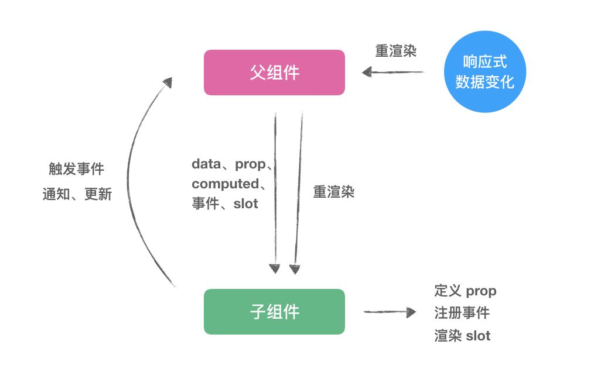

### 模板渲染

Vue.js 的核心是声明式渲染，与命令式渲染不同，声明式渲染只需要告诉程序，我们想要的什么效果，其他的事情让程序自己去做。而命令式渲染，需要命令程序一步一步根据命令执行渲染。如下例子区分：

```js
var arr = [1, 2, 3, 4, 5];

// 命令式渲染，关心每一步、关心流程。用命令去实现
var newArr = [];
for (var i = 0; i < arr.length; i++) {
    newArr.push(arr[i] * 2);
}

// 声明式渲染，不用关心中间流程，只需要关心结果和实现的条件
var newArr1 = arr.map(function (item) {
    return item * 2;
});
```

Vue.js 实现了if、for、事件、数据绑定等指令，允许采用简洁的模板语法来声明式地将数据渲染出视图。

#### 模板编译

为什么要进行模板编译？实际上，我们组件中的 template 语法是无法被浏览器解析的，因为它不是正确的 HTML 语法，而模板编译，就是将组件的 template 编译成可执行的 JavaScript 代码，即将 template 转化为真正的渲染函数。

模板编译分三个阶段，`parse`、`optimize`、`generate`，最终生成`render`函数。

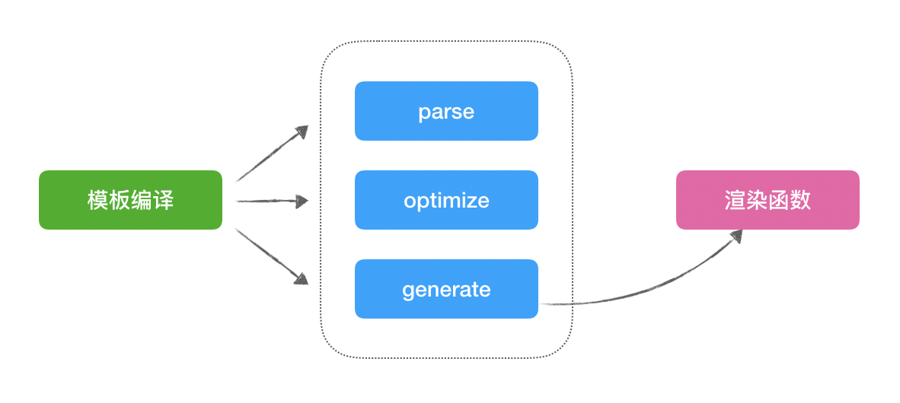

`parse`阶段：使用正在表达式将`template`进行字符串解析，得到指令、class、style等数据，生成抽象语法树 AST。

`optimize`阶段：寻找 AST 中的静态节点进行标记，为后面 VNode 的 patch 过程中对比做优化。被标记为 static 的节点在后面的 diff 算法中会被直接忽略，不做详细的比较。

`generate`阶段：根据 AST 结构拼接生成 render 函数的字符串。

#### 预编译

对于 Vue 组件来说，模板编译只会在组件实例化的时候编译一次，生成渲染函数之后在也不会进行编译。因此，编译对组件的 runtime 是一种性能损耗。而模板编译的目的仅仅是将`template`转化为`render function`，而这个过程，正好可以在项目构建的过程中完成。

比如`webpack`的`vue-loader`依赖了[`vue-template-compiler`](https://www.npmjs.com/package/vue-template-compiler)模块，在 webpack 构建过程中，将`template`预编译成 render 函数，在 runtime 可直接跳过模板编译过程。

回过头看，runtime 需要是仅仅是 render 函数，而我们有了预编译之后，我们只需要保证构建过程中生成 render 函数就可以。与 React 类似，在添加`JSX`的语法糖编译器[`babel-plugin-transform-vue-jsx`](https://www.npmjs.com/package/babel-plugin-transform-vue-jsx)之后，我们可以在 Vue 组件中使用`JSX`语法直接书写 render 函数。

```html
<script>
export default {
    data() {
        return {
            msg: 'Hello JSX.'
        }
    },
    render() {
        const msg = this.msg;
        return <div>
            {msg}
        </div>;
    }
}
</script>
```

如上面组件，使用 JSX 之后，可以在 JS 代码中直接使用 html 标签，而且声明了 render 函数以后，我们不再需要声明 template。当然，假如我们同时声明了 template 标签和 render 函数，构建过程中，template 编译的结果将覆盖原有的 render 函数，即 template 的优先级高于直接书写的 render 函数。

相对于 template 而言，JSX 具有更高的灵活性，面对与一些复杂的组件来说，JSX 有着天然的优势，而 template 虽然显得有些呆滞，但是代码结构上更符合视图与逻辑分离的习惯，更简单、更直观、更好维护。

需要注意的是，最后生成的 render 函数是被包裹在`with`语法中运行的。

### 小结

Vue 组件通过 prop 进行数据传递，并实现了数据总线系统`EventBus`，组件集成了`EventBus`进行事件注册监听、事件触发，使用`slot`进行内容分发。

除此以外，实现了一套声明式模板系统，在`runtime`或者预编译是对模板进行编译，生成渲染函数，供组件渲染视图使用。

## 响应式系统

Vue.js 是一款 MVVM 的JS框架，当对数据模型`data`进行修改时，视图会自动得到更新，即框架帮我们完成了更新DOM的操作，而不需要我们手动的操作DOM。可以这么理解，当我们对数据进行赋值的时候，Vue 告诉了所有依赖该数据模型的组件，你依赖的数据有更新，你需要进行重渲染了，这个时候，组件就会重渲染，完成了视图的更新。

### 数据模型 && 计算属性 && 监听器

在组件中，可以为每个组件定义数据模型`data`、计算属性`computed`、监听器`watch`。

数据模型：Vue 实例在创建过程中，对数据模型`data`的每一个属性加入到响应式系统中，当数据被更改时，视图将得到响应，同步更新。`data`必须采用函数的方式 return，不使用 return 包裹的数据会在项目的全局可见，会造成变量污染；使用return包裹后数据中变量只在当前组件中生效，不会影响其他组件。

计算属性：`computed`基于组件响应式依赖进行计算得到结果并缓存起来。只在相关响应式依赖发生改变时它们才会重新求值，也就是说，只有它依赖的响应式数据（data、prop、computed本身）发生变化了才会重新计算。那什么时候应该使用计算属性呢？模板内的表达式非常便利，但是设计它们的初衷是用于简单运算的。在模板中放入太多的逻辑会让模板过重且难以维护。对于任何复杂逻辑，你都应当使用计算属性。

监听器：监听器`watch`作用如其名，它可以监听响应式数据的变化，响应式数据包括 data、prop、computed，当响应式数据发生变化时，可以做出相应的处理。当需要在数据变化时执行异步或开销较大的操作时，这个方式是最有用的。

### 响应式原理

在 Vue 中，数据模型下的所有属性，会被 Vue 使用`Object.defineProperty`（Vue3.0 使用 Proxy）进行数据劫持代理。响应式的核心机制是观察者模式，数据是被观察的一方，一旦发生变化，通知所有观察者，这样观察者可以做出响应，比如当观察者为视图时，视图可以做出视图的更新。

Vue.js 的响应式系统以来三个重要的概念，`Observer`、`Dep`、`Watcher`。

#### 发布者-Observer

Observe 扮演的角色是发布者，他的主要作用是在组件`vm`初始化的时，调用`defineReactive`函数，使用`Object.defineProperty`方法对对象的每一个子属性进行数据劫持/监听，即为每个属性添加`getter`和`setter`，将对应的属性值变成响应式。

在组件初始化时，调用`initState`函数，内部执行`initState`、`initProps`、`initComputed`方法，分别对`data`、`prop`、`computed`进行初始化，让其变成响应式。

初始化`props`时，对所有`props`进行遍历，调用`defineReactive`函数，将每个 prop 属性值变成响应式，然后将其挂载到`_props`中，然后通过代理，把`vm.xxx`代理到`vm._props.xxx`中。

同理，初始化`data`时，与`prop`相同，对所有`data`进行遍历，调用`defineReactive`函数，将每个 data 属性值变成响应式，然后将其挂载到`_data`中，然后通过代理，把`vm.xxx`代理到`vm._data.xxx`中。

初始化`computed`，首先创建一个观察者对象`computed-watcher`，然后遍历`computed`的每一个属性，对每一个属性值调用`defineComputed`方法，使用`Object.defineProperty`将其变成响应式的同时，将其代理到组件实例上，即可通过`vm.xxx`访问到`xxx`计算属性。

#### 调度中心/订阅器-Dep

Dep 扮演的角色是调度中心/订阅器，在调用`defineReactive`将属性值变成响应式的过程中，也为每个属性值实例化了一个`Dep`，主要作用是对观察者（Watcher）进行管理，收集观察者和通知观察者目标更新，即当属性值数据发生改变时，会遍历观察者列表（dep.subs），通知所有的 watcher，让订阅者执行自己的update逻辑。

其`dep`的任务是，在属性的`getter`方法中，调用`dep.depend()`方法，将观察者（即 Watcher，可能是组件的render function，可能是 computed，也可能是属性监听 watch）保存在内部，完成其依赖收集。在属性的`setter`方法中，调用`dep.notify()`方法，通知所有观察者执行更新，完成派发更新。

#### 观察者-Watcher

Watcher 扮演的角色是订阅者/观察者，他的主要作用是为观察属性提供回调函数以及收集依赖，当被观察的值发生变化时，会接收到来自调度中心`Dep`的通知，从而触发回调函数。

而`Watcher`又分为三类，`normal-watcher`、 `computed-watcher`、 `render-watcher`。

* normal-watcher：在组件钩子函数`watch`中定义，即监听的属性改变了，都会触发定义好的回调函数。

* computed-watcher：在组件钩子函数`computed`中定义的，每一个`computed`属性，最后都会生成一个对应的`Watcher`对象，但是这类`Watcher`有个特点：当计算属性依赖于其他数据时，属性并不会立即重新计算，只有之后其他地方需要读取属性的时候，它才会真正计算，即具备`lazy`（懒计算）特性。

* render-watcher：每一个组件都会有一个`render-watcher`, 当`data/computed`中的属性改变的时候，会调用该`Watcher`来更新组件的视图。

这三种`Watcher`也有固定的执行顺序，分别是：computed-render -> normal-watcher -> render-watcher。这样就能尽可能的保证，在更新组件视图的时候，computed 属性已经是最新值了，如果 render-watcher 排在 computed-render 前面，就会导致页面更新的时候 computed 值为旧数据。

### 小结

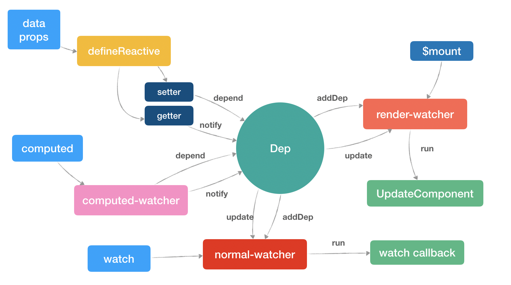

Observer 负责将数据进行拦截，Watcher 负责订阅，观察数据变化， Dep 负责接收订阅并通知 Observer 和接收发布并通知所有 Watcher。

## Virtual DOM

在 Vue 中，`template`被编译成浏览器可执行的`render function`，然后配合响应式系统，将`render function`挂载在`render-watcher`中，当有数据更改的时候，调度中心`Dep`通知该`render-watcher`执行`render function`，完成视图的渲染与更新。

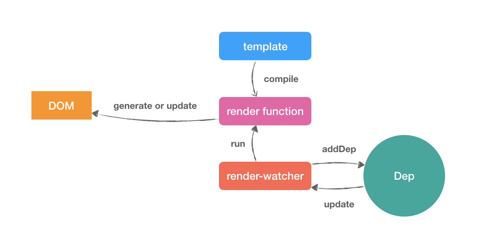

整个流程看似通顺，但是当执行`render function`时，如果每次都全量删除并重建 DOM，这对执行性能来说，无疑是一种巨大的损耗，因为我们知道，浏览器的DOM很“昂贵”的，当我们频繁的更新 DOM，会产生一定的性能问题。

为了解决这个问题，Vue 使用 JS 对象将浏览器的 DOM 进行的抽象，这个抽象被称为 Virtual DOM。Virtual DOM 的每个节点被定义为`VNode`，当每次执行`render function`时，Vue 对更新前后的`VNode`进行`Diff`对比，找出尽可能少的我们需要更新的真实 DOM 节点，然后只更新需要更新的节点，从而解决频繁更新 DOM 产生的性能问题。

### VNode

VNode，全程`virtual node`，即虚拟节点，对真实 DOM 节点的虚拟描述，在 Vue 的每一个组件实例中，会挂载一个`$createElement`函数，所有的`VNode`都是由这个函数创建的。

比如创建一个 div：

```js
// 声明 render function
render: function (createElement) {
    // 也可以使用 this.$createElement 创建 VNode
    return createElement('div', 'hellow world');
}
// 以上 render 方法返回html片段 <div>hellow world</div>
```

render 函数执行后，会根据`VNode Tree`将 VNode 映射生成真实 DOM，从而完成视图的渲染。

### Diff

Diff 将新老 VNode 节点进行比对，然后将根据两者的比较结果进行最小单位地修改视图，而不是将整个视图根据新的 VNode 重绘，进而达到提升性能的目的。

#### patch

Vue.js 内部的 diff 被称为`patch`。其 diff 算法的是通过同层的树节点进行比较，而非对树进行逐层搜索遍历的方式，所以时间复杂度只有O(n)，是一种相当高效的算法。

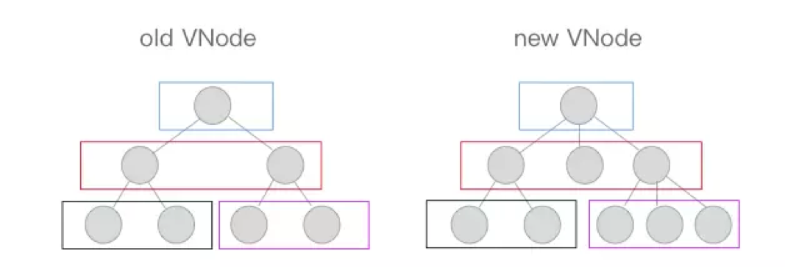

首先定义新老节点是否相同判定函数`sameVnode`：满足键值`key`和标签名`tag`必须一致等条件，返回`true`，否则`false`。

在进行`patch`之前，新老 VNode 是否满足条件`sameVnode(oldVnode, newVnode)`，满足条件之后，进入流程`patchVnode`，否则被判定为不相同节点，此时会移除老节点，创建新节点。

#### patchVnode

patchVnode 的主要作用是判定如何对子节点进行更新，

1. 如果新旧VNode都是静态的，同时它们的key相同（代表同一节点），并且新的 VNode 是 clone 或者是标记了 once（标记v-once属性，只渲染一次），那么只需要替换 DOM 以及 VNode 即可。

2. 新老节点均有子节点，则对子节点进行 diff 操作，进行`updateChildren`，这个 updateChildren 也是 diff 的核心。

3. 如果老节点没有子节点而新节点存在子节点，先清空老节点 DOM 的文本内容，然后为当前 DOM 节点加入子节点。

4. 当新节点没有子节点而老节点有子节点的时候，则移除该 DOM 节点的所有子节点。

5. 当新老节点都无子节点的时候，只是文本的替换。

#### updateChildren

Diff 的核心，对比新老子节点数据，判定如何对子节点进行操作，在对比过程中，由于老的子节点存在对当前真实 DOM 的引用，新的子节点只是一个 VNode 数组，所以在进行遍历的过程中，若发现需要更新真实 DOM 的地方，则会直接在老的子节点上进行真实 DOM 的操作，等到遍历结束，新老子节点则已同步结束。

`updateChildren`内部定义了4个变量，分别是`oldStartIdx`、`oldEndIdx`、`newStartIdx`、`newEndIdx`，分别表示正在 Diff 对比的新老子节点的左右边界点索引，在老子节点数组中，索引在`oldStartIdx`与`oldEndIdx`中间的节点，表示老子节点中为被遍历处理的节点，所以小于`oldStartIdx`或大于`oldEndIdx`的表示未被遍历处理的节点。同理，在新的子节点数组中，索引在`newStartIdx`与`newEndIdx`中间的节点，表示老子节点中为被遍历处理的节点，所以小于`newStartIdx`或大于`newEndIdx`的表示未被遍历处理的节点。

每一次遍历，`oldStartIdx`和`oldEndIdx`与`newStartIdx`和`newEndIdx`之间的距离会向中间靠拢。当 oldStartIdx > oldEndIdx 或者 newStartIdx > newEndIdx 时结束循环。

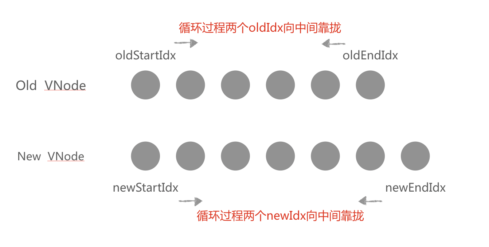

在遍历中，取出4索引对应的 Vnode节点：

* oldStartIdx：oldStartVnode
* oldEndIdx：oldEndVnode
* newStartIdx：newStartVnode
* newEndIdx：newEndVnode

diff 过程中，如果存在`key`，并且满足`sameVnode`，会将该 DOM 节点进行复用，否则则会创建一个新的 DOM 节点。

首先，`oldStartVnode`、`oldEndVnode`与`newStartVnode`、`newEndVnode`两两比较，一共有 2*2=4 种比较方法。

情况一：当`oldStartVnode`与`newStartVnode`满足 sameVnode，则`oldStartVnode`与`newStartVnode`进行 patchVnode，并且`oldStartIdx`与`newStartIdx`右移动。

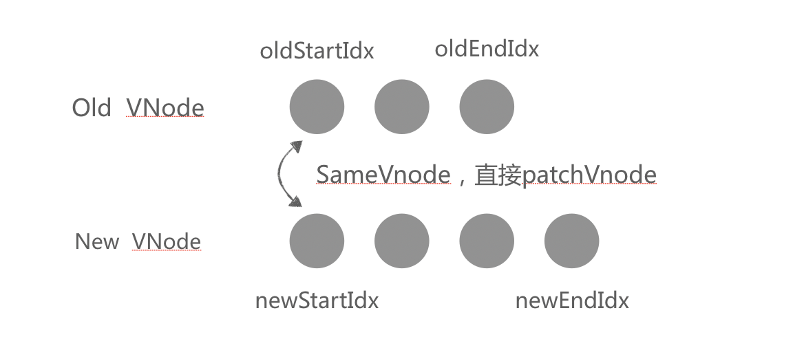

情况二：与情况一类似，当`oldEndVnode`与`newEndVnode`满足 sameVnode，则`oldEndVnode`与`newEndVnode`进行 patchVnode，并且`oldEndIdx`与`newEndIdx`左移动。

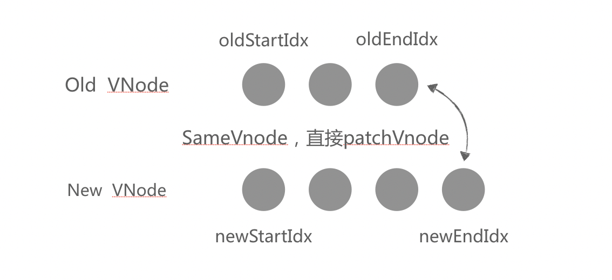

情况三：当`oldStartVnode`与`newEndVnode`满足 sameVnode，则说明`oldStartVnode`已经跑到了`oldEndVnode`后面去了，此时`oldStartVnode`与`newEndVnode`进行 patchVnode 的同时，还需要将`oldStartVnode`的真实 DOM 节点移动到`oldEndVnode`的后面，并且`oldStartIdx`右移，`newEndIdx`左移。

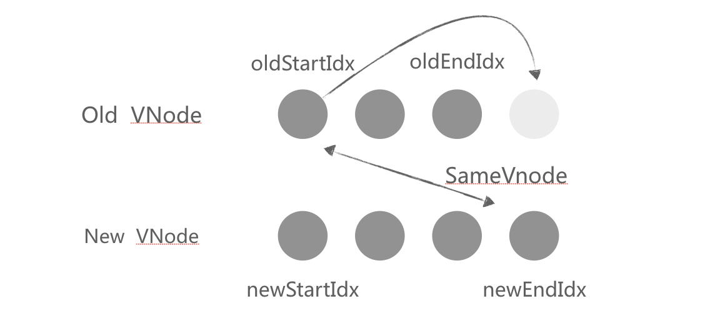

情况四：与情况三类似，当`oldEndVnode`与`newStartVnode`满足 sameVnode，则说明`oldEndVnode`已经跑到了`oldStartVnode`前面去了，此时`oldEndVnode`与`newStartVnode`进行 patchVnode 的同时，还需要将`oldEndVnode`的真实 DOM 节点移动到`oldStartVnode`的前面，并且`oldStartIdx`右移，`newEndIdx`左移。

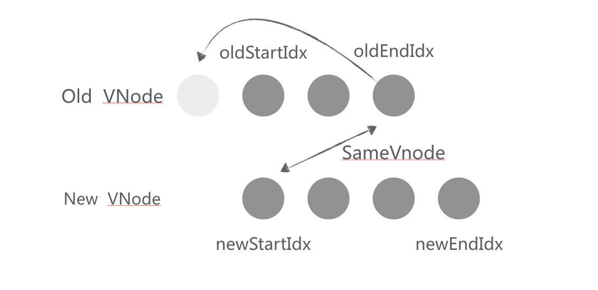

当这四种情况都不满足，则在`oldStartIdx`与`oldEndIdx`之间查找与`newStartVnode`满足`sameVnode`的节点，若存在，则将匹配的节点真实 DOM 移动到`oldStartVnode`的前面。

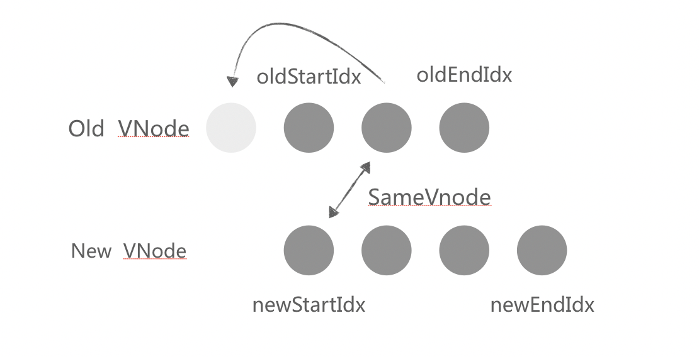

若不存在，说明`newStartVnode`为新节点，创建新节点放在`oldStartVnode`前面即可。

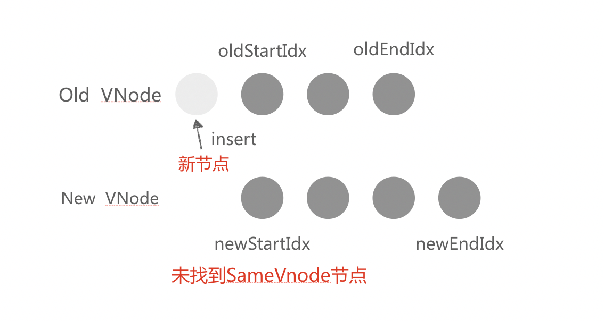

当 oldStartIdx > oldEndIdx 或者 newStartIdx > newEndIdx，循环结束，这个时候我们需要处理那些未被遍历到的 VNode。

当 oldStartIdx > oldEndIdx 时，说明老的节点已经遍历完，而新的节点没遍历完，这个时候需要将新的节点创建之后放在`oldEndVnode`后面。

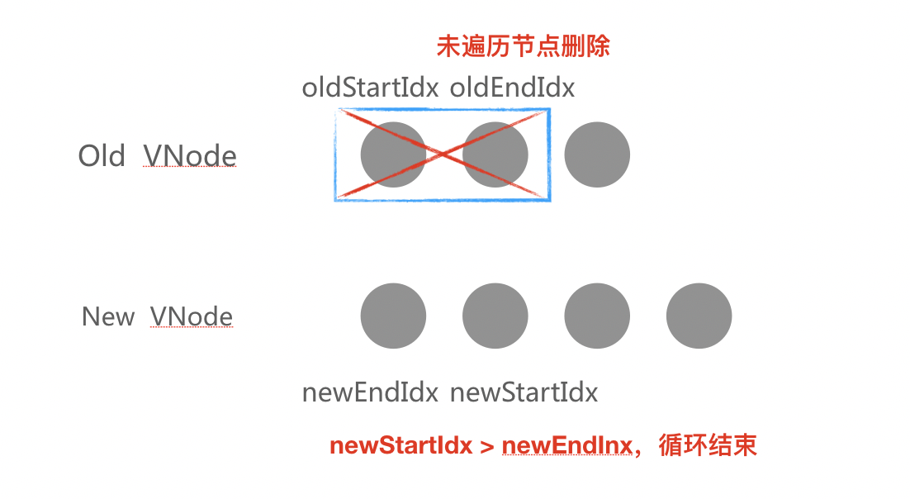

当 newStartIdx > newEndIdx 时，说明新的节点已经遍历完，而老的节点没遍历完，这个时候要将没遍历的老的节点全都删除。

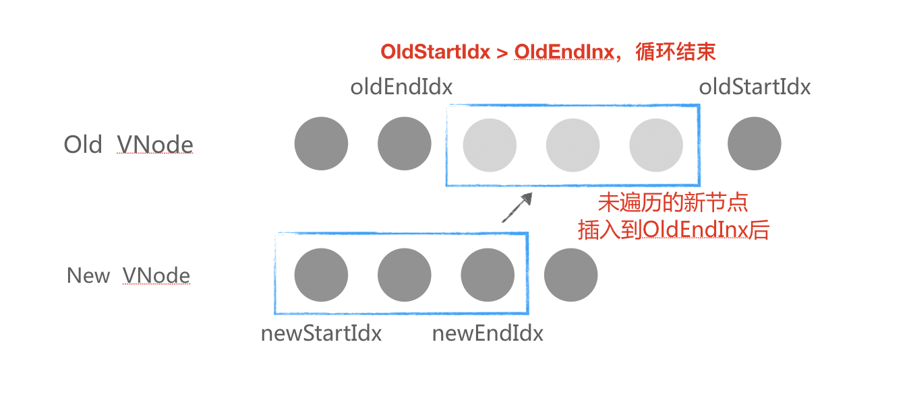

此时已经完成了子节点的匹配。下面是一个例子 patch 过程图：

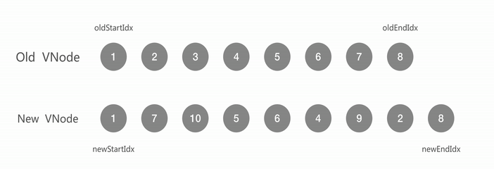

## 总结

借用官方的一幅图：


Vue.js 实现了一套声明式渲染引擎，并在`runtime`或者预编译时将声明式的模板编译成渲染函数，挂载在观察者 Watcher 中，在渲染函数中（touch），响应式系统使用响应式数据的`getter`方法对观察者进行依赖收集（Collect as Dependency），使用响应式数据的`setter`方法通知（notify）所有观察者进行通知更新，此时观察者 Watcher 会触发组件的渲染函数（Trigger re-render），组件执行的 render 函数，生成一个新的 Virtual DOM Tree，此时 Vue 会对新老 Virtual DOM Tree 进行 Diff，查找出需要操作的真实 DOM 并对其进行更新。

## 参考

* [聊聊 VueJs 组件化编程](https://mp.weixin.qq.com/s?__biz=MzIyMDEwNzIwNQ==&mid=2649619127&idx=1&sn=e75d7ae41b679b9e2f558bee8f1ea82d&scene=4#wechat_redirect)

* [深入理解vue中的slot与slot-scope](https://juejin.im/post/5a69ece0f265da3e5a5777ed?utm_source=gold_browser_extension)

* [vue响应式系统--observe、watcher、dep](https://blog.csdn.net/hf872914334/article/details/89098295)

* [Vue.js技术揭秘](https://ustbhuangyi.github.io/vue-analysis/v2/prepare/)

* [VirtualDOM与diff(Vue实现)](https://juejin.im/post/59bfbd736fb9a00a52065ec7)