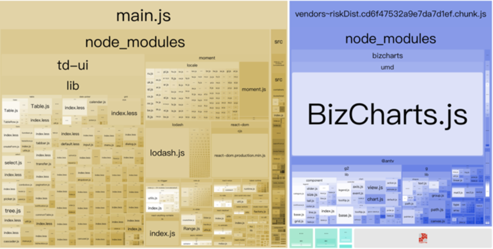
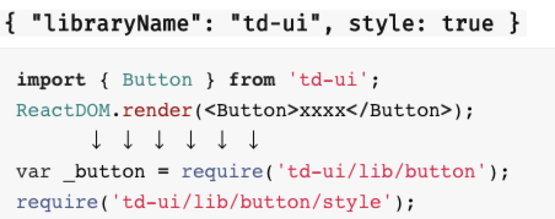
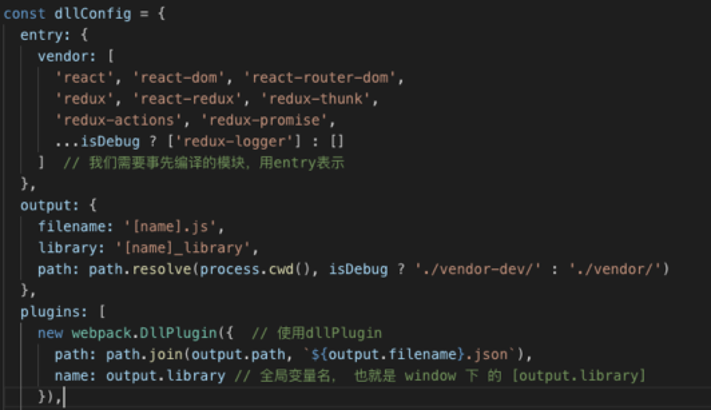
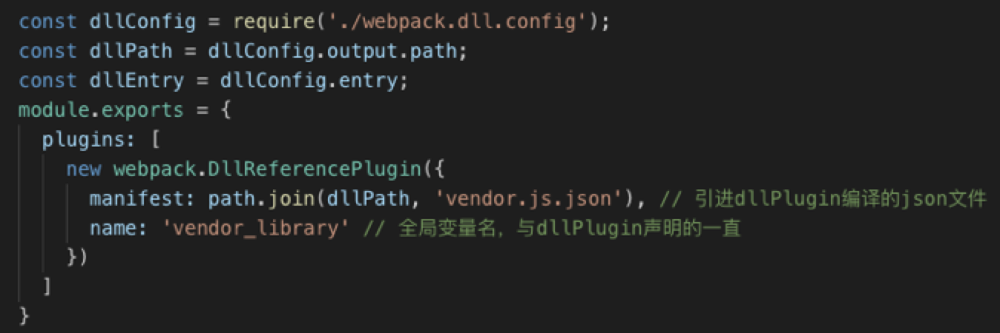
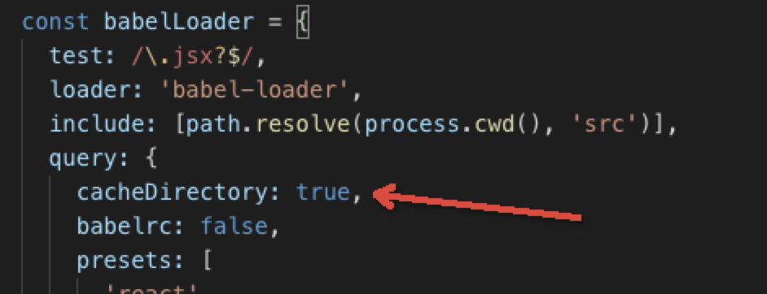
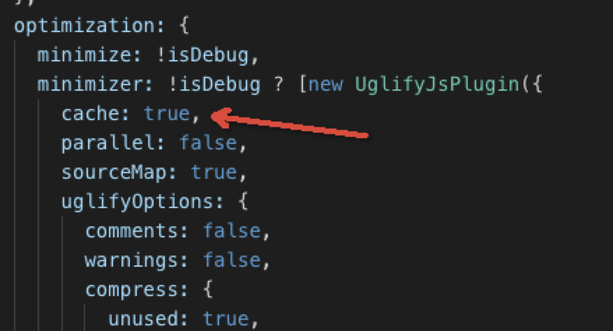
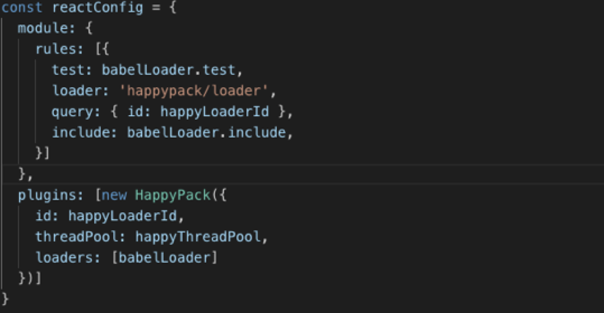
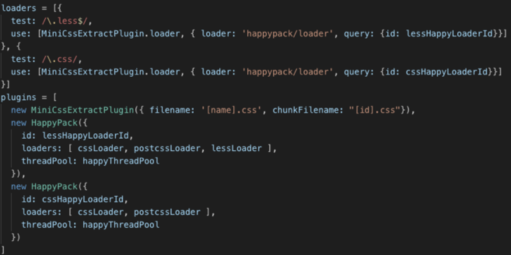

## 前言

随着业务复杂度的不断的增加，工程模块的体积也会不断增加，构建后的模块通常要以M为单位计算。在构建过程中，基于nodejs的webpack在单进程的情况下loader表现变得越来越慢，在不做任何特殊处理的情况下，构建完后的多项目之间公用基础资源存在重复打包，基础库代码复用率也不高，这都慢慢暴露出webpack的问题。

## 正文

针对存在的问题，社区涌出了各种解决方案，包括webpack自身也在不断优化。

### 构建优化

下面利用相关的方案对实际项目一步一步进行构建优化，提升我们的编译速度，本次优化相关属性如下：

* 机器： Macbook Air 四核 8G内存

* Webpack： v4.10.2

* 项目：922个模块

构建优化方案如下：

* 减少编译体积大小

* 将大型库外链

* 将库预先编译

* 使用缓存

* 并行编译

初始构建时间如下：

| **增量构建** | **Development** **构建** | **Production** **构建** | **备注** |
| ------------ | ------------------------ | ----------------------- | -------- |
| 3088ms       | 43702ms                  | 89371ms                 |          |

#### 减少编译体积大小

初始构建时候，我们利用`webpack-bundle-analyzer`对编译结果进行分析，结果如下：



可以看到，td-ui（类似于antd的ui组件库）、moment库的locale、BizCharts占了项目的大部分体积，而在没有全部使用这些库的全部内容的情况下，我们可以对齐进行按需加载。

针对td-ui和BizCharts，我们对齐添加按需加载`babel-plugin-import`，这个包可以在使用ES6模块导入的时候，对其进行分析，解析成引入相应文件夹下面的模块，如下：



首先，我们先添加babel的配置，在plugins中加入`babel-plugin-import`:

```json
{
    ...
    "plugins": [
        ...
        ["import", [
            { libraryName: 'td-ui', style: true },
            { libraryName: 'bizcharts', libraryDirectory: 'lib/components' },
        ]]
    ]
}
```

可以看到，我们给bizcharts也添加了按需加载，配置中添加了按需加载的指定文件夹，针对bizcharts，编译前后代码对比如下：

编译前：


编译后：


注意：`bizcharts`按需加载需要引入其核心代码`bizcharts/lib/core`;

到此为止，td-ui和bizcharts的按需加载已经处理完毕，接下来是针对moment的处理。moment的主要体积来源于locale国际化文件夹，由于项目中有中英文国际化的需求，我们这里使用`webpack.ContextReplacementPugin`对该文件夹的上下文进行匹配，只匹配中文和英文的语言包，plugin配置如下：

```js
new webpack.ContextReplacementPugin(
    /moment[\/\\]locale$/, //匹配文件夹
    /zh-cn|en-us/  // 中英文语言包
)
```

如果没有国际化的需求，可以使用`webpack.IgnorePlugin`对整个locale文件夹进行忽略，配置如下：

```js
new webpack.IgnorePlugin(/^\.\/locale$/, /moment$/)
```

减少编译体积大小完成之后得到如下构建对比结果：

| **增量构建** | **Development ** **构建** | **Production**  **构建** | **备注**         |
| ------------ | ------------------------- | ------------------------ | ---------------- |
| 3088ms       | 43702ms                   | 89371ms                  |                  |
| 2561ms       | 27864ms                   | 67441ms                  | 减少编译体积大小 |

#### 将大型库外链 && 将库预先编译

为了避免一些已经编译好的大型库重新编译，我们需要将这些库放在编译意外的地方，或者预先编译这些库。

webpack也为我们提供了将模块外链的配置`externals`，比如我们把lodash外链，配置如下

```js
module.exports = {
  //...
  externals : {
    lodash: 'window._'
  },

  // 或者

  externals : {
    lodash : {
      commonjs: 'lodash',
      amd: 'lodash',
      root: '_' // 指向全局变量
    }
  }
};
```

针对库预先编译，webpack也提供了相应的插件，那就是`webpack.Dllplugin`，这个插件可以预先编译制定好的库，最后在实际项目中使用`webpack.DllReferencePlugin`将预先编译好的库关联到当前的编译结果中，无需重新编译。

Dllplugin配置文件webpack.dll.config.js如下：



dllReference配置文件webpack.dll.reference.config.js如下：



最后使用`webpack-merge`将`webpack.dll.reference.config.js`合并到到webpack配置中。

注意：预先编译好的库文件需要在html中手动引入并且必须放在webpack的entry引入之前，否则会报错。

其实，将大型库外链和将库预先编译也属于减少编译体积的一种，最后得到编译时间结果如下：

| **增量构建** | **Development** **构建** | **Production** **构建** | **备注**         |
| ------------ | ------------------------ | ----------------------- | ---------------- |
| 3088ms       | 43702ms                  | 89371ms                 |                  |
| 2561ms       | 27864ms                  | 67441ms                 | 减少编译体积大小 |
| 2246ms       | 22870ms                  | 50601ms                 | Dll优化后        |

#### 使用缓存

首先，我们开启babel-loader自带的缓存功能（默认其实就是打开的）。



另外，开启`uglifyjs-webpack-plugin`的缓存功能。



添加缓存插件`hard-source-webpack-plugin`（当然也可以添加cache-loader）

```js
const hardSourcePlugin = require('hard-source-webpack-plugin');

moudle.exports = {
    // ...
    plugins: [
        new hardSourcePlugin()
    ],
    // ...
}
```

添加缓存后编译结果如下：

| **增量构建** | **Development** **构建** | **Production** **构建** | **备注**         |
| ------------ | ------------------------ | ----------------------- | ---------------- |
| 3088ms       | 43702ms                  | 89371ms                 |                  |
| 2561ms       | 27864ms                  | 67441ms                 | 减少编译体积大小 |
| 2246ms       | 22870ms                  | 50601ms                 | Dll优化后        |
| 1918ms       | 10056ms                  | 17298ms                 | 使用缓存后       |

可以看到，编译效果极好。

#### 并行编译

由于nodejs为单线程，为了更好利用好电脑多核的特性，我们可以将编译并行开始，这里我们使用`happypack`，当然也可以使用`thread-loader`，我们将babel-loader和样式的loader交给happypck接管。

babel-loader配置如下：



less-loader配置如下：



构建结果如下：

| **增量构建** | **Development** **构建** | **Production** **构建** | **备注**         |
| ------------ | ------------------------ | ----------------------- | ---------------- |
| 3088ms       | 43702ms                  | 89371ms                 |                  |
| 2561ms       | 27864ms                  | 67441ms                 | 减少编译体积大小 |
| 2246ms       | 22870ms                  | 50601ms                 | Dll优化后        |
| 1918ms       | 10056ms                  | 17298ms                 | 使用缓存后       |
| 2252ms       | 11846ms                  | 18727ms                 | 开启happypack后  |

可以看到，添加happypack之后，编译时间有所增加，针对这个结果，我对webpack版本和项目大小进行了对比测试，如下：


* Webpack：v2.7.0

* 项目：1013个模块

* 全量production构建：105395ms

添加happypack之后，全量production构建时间降低到`58414ms`。


针对webpack版本：

* Webpack：v4.23.0

* 项目：1013个模块

* 全量development构建 : 12352ms

添加happypack之后，全量development构建降低到11351ms。


得到结论：Webpack v4 之后，happypack已经力不从心，效果并不明显，而且在小型中并不适用。

所以针对并行加载方案要不要加，要具体项目具体分析。


### 性能优化

对于webpack编译出来的结果，也有相应的性能优化的措施。方案如下：

* 减少模块数量及大小

* 合理缓存

* 合理拆包

#### 减少模块数量及大小

针对减少模块数量及大小，我们在构建优化的章节中有提到很多，具体点如下：

* 按需加载 babel-plugin-import（antd、iview、bizcharts）、babel-plugin-component（element-ui）
* 减少无用模块webpack.ContextReplacementPlugin、webpack.IgnorePlugin
* Tree-shaking：树摇功能，消除无用代码，无用模块。
* Scope-Hoisting：作用域提升。
* babel-plugin-transform-runtime，针对babel-polyfill清除不必要的polyfill。

前面两点我们就不具体描述，在构建优化章节中有说。

##### Tree-shaking

树摇功能，将树上没用的叶子摇下来，寓意将没有必要的代码删除。该功能在webapck V2中已被webpack默认开启，但是使用前提是，`模块必须是ES6模块`，因为ES6模块为静态分析，动态引入的特性，可以让webpack在构建模块的时候知道，那些模块内容在引入中被使用，那些模块没有被使用，然后将没有被引用的的模块在转为为AST后删除。

由于必须使用ES6模块，我们需要将babel的自动模块转化功能关闭，否则你的es6模块将自动转化为commonjs模块，配置如下：

```js
{
    "presets": [
        "react",
        "stage-2",
        [
            "env",
            {
                "modlues": false // 关闭babel的自动转化模块功能，保留ES6模块语法
            }
        ]
    ]
}
```

Tree-shaking编译时候可以在命令后使用--display-used-exports可以在shell打印出关于代码剔除的提示。

##### Scope-Hoisting

作用域提升，尽可能的把打散的模块合并到一个函数中，前提是不能造成代码冗余。因此只有那些被引用了一次的模块才能被合并。

可能不好理解，下面demo对比一下有无Scope-Hoisting的编译结果。

首先定义一个util.js文件

```js
export default 'Hello,Webpack';
```

然后定义入口文件main.js

```js
import str from './util.js'
console.log(str);
```

下面是无Scope-Hoisting结果：


然后是Scope-Hoisting后的结果：


与Tree-Shaking类似，使用Scope-Hoisting的前提也是必须是ES6模块，除此之外，还需要加入webpack内置插件，位于webpack文件夹，`webpack/lib/optimize/ModuleConcatenationPlugin`，配置如下：

```js
const ModuleConcatenationPlugin = require('webpack/lib/optimize/ModuleConcatenationPlugin');
module.exports = {
    //...
    plugins: [
        new ModuleConcatenationPlugin()
    ]
    //...
}
```

另外，为了跟好的利用Scope-Hoisting，针对Npm的第三方模块，它们也可能提供了ES6模块，我们可以指定优先使用它们的ES6模块，而不是使用它们编译后的代码，webpack的配置如下：

```js
module.exports = {
    //...
    resolve: {
        // 优先采用jsnext:main中指定的ES6模块文件
        mainFields: ['jsnext:main', 'module', 'browser', 'main']
    }
    //...
}
```

`jsnext:main`为业内大家约定好的存放ES6模块的文件夹，后续为了规范，更改为`module`文件夹。

##### babel-plugin-transform-runtime

在我们实际的项目中，为了兼容一些老式的浏览器，我们需要在项目加入babel-polyfill这个包。由于babel-polyfill太大，导致我们编译后的包体积增大，降低我们的加载性能，但是实际上，我们只需要加入我们使用到的不兼容的内容的polyfill就可以，这个时候`babel-plugin-transform-runtime`就可以帮我们去除那些我们没有使用到的polyfill，当然，你需要在`babal-preset-env`中配置你需要兼容的浏览器，否则会使用默认兼容浏览器。

添加babel-plugin-transform-runtime的.babelrc配置如下：

```json
{
    "presets": [["env", {
        "targets": {
            "browsers": ["last 2 versions", "safari >= 7", "ie >= 9", "chrome >= 52"] // 配置兼容浏览器版本
        },
        "modules": false
    }], "stage-2"],
    "plugins": [
        "transform-class-properties",
        "transform-runtime", // 添加babel-plugin-transform-runtime
        "transform-decorators-legacy"
    ]
}
```


#### 合理使用缓存

webpack对应的缓存方案为添加hash，那我们为什么要给静态资源添加hash呢？

* 避免覆盖旧文件
* 回滚方便，只需要回滚html
* 由于文件名唯一，可开启服务器永远缓

然后，webpack对应的hash有两种，`hash`和`chunkhash`。

* hash是跟整个项目的构建相关，只要项目里有文件更改，整个项目构建的hash值都会更改，并且全部文件都共用相同的hash值
* chunkhash根据不同的入口文件(Entry)进行依赖文件解析、构建对应的chunk，生成对应的哈希值。

细想我们期望的最理想的hash就是当我们的编译后的文件，不管是初始化文件，还是chunk文件或者样式文件，只要文件内容一修改，我们的hash就应该更改，然后刷新缓存。可惜，hash和chunkhash的最终效果都没有达到我们的预期。

另外，还有来自于的 `extract-text-webpack-plugin`的 `contenthash`，contenthash针对编译后的每个文件内容生成hash。只是extract-text-webpack-plugin在wbepack4中已经被弃用，而且这个插件只对css文件生效。

##### webpack-md5-hash

为了达到我们的预期效果，我们可以为webpack添加`webpack-md5-hash`插件，这个插件可以让webpack的chunkhash根据文件内容生成hash，相对稳定，这样就可以达到我们预期的效果了，配置如下：

```js

var WebpackMd5Hash = require('webpack-md5-hash');
 
module.exports = {
    // ...
    output: {
        //...
        chunkFilename: "[chunkhash].[id].chunk.js"
    },
    plugins: [
        new WebpackMd5Hash()
    ]
};

```

#### 合理拆包

为了减少首屏加载的时候，我们需要将包拆分成多个包，然后需要的时候在加载，拆包方案有：

* 第三方包，DllPlugin、externals。
* 动态拆包，利用import()、require.ensure()语法拆包
* splitChunksPlugin

针对第一点第三方包，我们也在第一章节构建优化中有介绍，这里就不详细说了。

##### 动态拆包

首先是import()，这是webpack提供的语法，webpack在解析到这样的语法时，会将指定的目录文件打包成一个chunk，当成异步加载文件输出到编译结果中，语法如下：

```js
import(/* webpackChunkName: chunkName */ './chunkFile.js').then(_module => {
    // do something
});
```

import()遵循promise规范，可以在then的回调函数中处理模块。

注意：import()的参数不能完全是动态的，如果是动态的字符串，需要预先指定前缀文件夹，然后webpack会把整个文件夹编译到结果中，按需加载。

然后是require.ensure()，与import()类似，为webpack提供函数，也是用来生成异步加载模块，只是是使用callback的形式处理模块，语法如下：

```js
// require.ensure(dependencies: String[], callback: function(require), chunkName: String)

require.ensure([], function(require){
	const _module = require('chunkFile.js');
}, 'chunkName');
```

##### splitChunksPlugin

webpack4中，将commonChunksPlugin废弃，引入splitChunksPlugin，两个plugin的作用都是用来切割chunk。

webpack 把 chunk 分为两种类型，initial和async。在webpack4的默认情况下，production构建会分析你的 entry、动态加载（import()、require.ensure）模块，找出这些模块之间共用的node_modules下的模块，并将这些模块提取到单独的chunk中，在需要的时候异步加载到页面当中。

默认配置如下：

```js
module.exports = {
  //...
  optimization: {
    splitChunks: {
      chunks: 'async', // 标记为异步加载的chunk
      minSize: 30000,
      minChunks: 1,
      maxAsyncRequests: 5,
      maxInitialRequests: 3,
      automaticNameDelimiter: '~', // 文件名中chunk的分隔符
      name: true,
      cacheGroups: {
        vendors: {
          test: /[\\/]node_modules[\\/]/,
          priority: -10
        },
        default: {
          minChunks: 2, // 最小共享的chunk数
          priority: -20,
          reuseExistingChunk: true
        }
      }
    }
  }
};
```

splitChunksPlugin提供了灵活的配置，开发者可以根据自己的需求分割chunk，比如下面官方的例子1代码：

```
module.exports = {
  //...
  optimization: {
    splitChunks: {
      cacheGroups: {
        commons: {
          name: 'commons',
          chunks: 'initial',
          minChunks: 2
        }
      }
    }
  }
};
```

意思是在所有的初始化模块中抽取公共部分，生成一个chunk，chunk名字为comons。

在如官方例子2代码：

```js
module.exports = {
  //...
  optimization: {
    splitChunks: {
      cacheGroups: {
        commons: {
          test: /[\\/]node_modules[\\/]/,
          name: 'vendors',
          chunks: 'all'
        }
      }
    }
  }
};
```

意思是从所有模块中抽离来自于node_modules下的所有模块，生成一个chunk。当然这只是一个例子，实际生产环境中并不推荐，因为会使我们首屏加载的包增大。

针对官方例子2，我们可以在开发环境中使用，因为在开发环境中，我们的node_modules下的所有文件是基本不会变动的，我们将其生产一个chunk之后，每次增量编译，webpack都不会去编译这个来自于node_modules的已经生产好的chunk，这样如果项目很大，来源于node_modules的模块非常多，这个时候可以大大降低我们的构建时间。

## 最后

现在大部分前端项目都是基于webpack进行构建的，面对这些项目，或多或少都有一些需要优化的地方，或许做优化不为完成KPI，仅为自己有更好的开发体验，也应该行动起来。