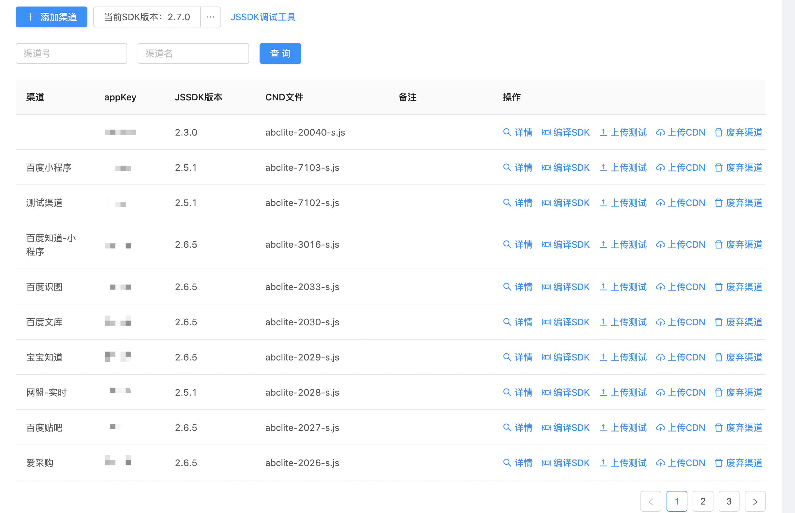
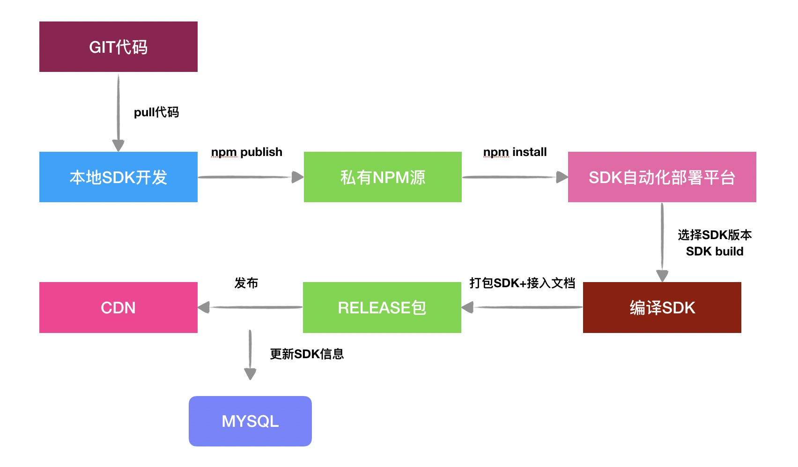

## 前言

是否有很多人跟我一样有这样的一个烦恼，每天有写不完的需求、改不完的BUG，每天撸着重复、繁琐的业务代码，担心着自己的技术成长。

其实换个角度，我们所学的所有前端技术都是服务于业务的，那我们为什么不想办法使用前端技术为业务做点东西？这样既能解决业务的困扰，也能让自己摆脱每天只能写重复繁琐代码的困扰。

本文主要为笔者针对当前团队内的一些业务问题，实现的一个自动化部署平台的技术方案。

## 背景

去年年初，由于团队里没有前端，刚好我是被招过来的第一个，也是唯一一个FE，于是我接手了一个一直由后端维护的JSSDK项目，其实也说不上项目，接手的时候它只是一个2000多行代码的胖脚本，没有任何工程化痕迹。

### 业务需求

这个JSSDK，主要作用是在后端了为业务方分配appKey之后，前端将appKey写死在JSSDK中，上传到CDN后，为业务方提供数据采集服务的脚本。

有的同学可能有疑问，为什么不像一些正常的SDK一样，appKey是以参数的形式传入到JSSDK中，这样就可以统一所有业务方使用同一个JSSDK，而不需要为每个业务业务方都提供一个JSSDK。其实我刚开始也是这么想的，于是我向我的leader提出了我的这个想法，被拒绝了，拒绝原因如下：

* appKey如果以参数形式传入，对业务方的接入成本有所增加，会出现appKey填错的问题。
* 业务方接入JSSDK之后，希望每次JSSDK版本迭代对业务方来说是无感知的（也就是版本迭代是覆盖式发布），如果所有业务方使用同一个JSSDK，每次JSSDK的版本迭代，一次发版会一次性对所有业务方都有影响，会增加风险。

由于我的leader现在主要是负责产品推广，经常和业务方打交道，可能他更能站在业务方的角度来考虑问题。所以，我的leader选择牺牲项目的维护成本来降低SDK的接入成本和规避风险，可以理解。

那既然我们改变不了现状，那就只能适应现状。

### 项目痛点

那么针对原来没有任何工程化情况的胖脚本，每次新增一个业务方，我需要做的事情如下：

1. 打开一个胖脚本和JSSDK接入文档，拷贝一份新的。
2. 找后端要分配好的appKey，找对对应的appKey那一行代码手动修改。
3. 手动混淆修改完好的脚本并上传到CDN。
4. 修改JSSDK接入文档中CDN的地址，保存后发送给业务方。

整个过程都需要手动进行，相对来说非常繁琐，并且一不小心就会填错，每次都需要对脚本和接入文档进行检查。

针对以上情况，得到我们需要解决的问题：

* 怎样针对一个新的业务方快速输出一份新的JSSDK和接入文档？
* 怎样快速对新的JSSDK进行混淆并上传到CDN。

## 自动化方案

介绍方案之前，先上一张平台截图，以便先有一个直观的认识：



SDK自动化部署平台主要实现了JSSDK的编译，发布测试（在线预览），上传CDN功能。

服务端技术栈包括：

*   [框架 Express](http://expressjs.com/)
*   [热更新 nodemon](https://github.com/remy/nodemon)
*   [依赖注入 awilix](https://github.com/jeffijoe/awilix)
*   [数据持久化 sequelize](https://github.com/sequelize/sequelize)
*   [部署 pm2](https://pm2.io/)

客户端技术栈就不介绍了，Vue全家桶 + [vue-property-decorator](https://github.com/kaorun343/vue-property-decorator#readme) + [vuex-class](https://github.com/ktsn/vuex-class)。

项目搭建参考：[Vue+Express+Mysql 全栈初体验](https://juejin.im/post/5ce96694f265da1bc5523f69)

自动化部署平台主要依赖于 GIT + 本地环境 + 私有NPM源 + MYSQL，各环节之间进行通信交互，完成自动化部署。



主要达到的效果：本地环境拉取git仓库代码后，进行需求开发，完成后发布一个带Rollup的SDK编译器包到私有NPM仓库，自动化部署平台在工程目录安装指定版本的SDK，并且备份到本地，在SDK编译时，选择特定版本的Rollup的SDK编译器，并传参（如appKey，appId等）到编译器中进行编译，同时自动生成JSSDK接入文档等后打包成带描述文件的Release包，在上传到CDN时，将描述文件的对应的信息写入MYSQL中进行保存。

### 版本管理

由于JSSDK原本只是一个脚本，我们必须实现项目的工程化，从而完成版本管理，方便快速版本切换进行发布，回滚，进而快速止损。

首先，我们需要将项目工程化，使用`Rollup`进行模块管理，并且在发包NPM包的时候，输入为各种参数（如appKey）输出为一个`Rollup Complier`的函数，然后使用[rollup-plugin-replace](https://www.npmjs.com/package/rollup-plugin-replace)在编译时候替换代码中具体的参数。

`lib/build.js`，JSSDK中发包的入口文件，提供给SDK编译时使用

```js
import * as rollup from 'rollup';
const replace = require('rollup-plugin-replace');
const path = require('path');
const pkgPath = path.join(__dirname, '..', 'package.json');
const pkg = require(pkgPath);
const proConfig = require('./proConfig');

function getRollupConfig(replaceParams) {
    const config = proConfig;
    // 注入系统变量
    const replacePlugin = replace({
        '__JS_SDK_VERSION__': JSON.stringify(pkg.version),
        '__SUPPLY_ID__': JSON.stringify(replaceParams.supplyId || '7102'),
        '__APP_KEY__': JSON.stringify(replaceParams.appKey)
    });
    return {
        input: config.input,
        output: config.output,
        plugins: [
            ...config.plugins,
            replacePlugin
        ]
    };
};

module.exports = async function (params) {
    const config = getRollupConfig({
        supplyId: params.supplyId || '7102',
        appKey: params.appKey
    });
    const {
        input,
        plugins
    } = config;
    const bundle = await rollup.rollup({
        input,
        plugins
    });
    const compiler = {
        async write(file) {
            await bundle.write({
                file,
                format: 'iife',
                sourcemap: false,
                strict: false
            });
        }
    };
    return compiler;
};
```

在自动化部署平台中，使用`shelljs`安装JSSDK包：

```js
import {route, POST} from 'awilix-express';
import {Api} from '../framework/Api';
import * as shell from 'shell';
import * as path from 'path';

@route('/supply')
export default class SupplyAPI extends Api {
    // some code

    @route('/installSdkVersion')
    @POST()
    async installSdkVersion(req, res) {
        const {version} = req.body;
        const pkg = `@baidu/xxx-js-sdk@${version}`;
        const registry = 'http://registry.npm.baidu-int.com';
        shell.exec(`npm i ${pkg} --registry=${registry}`, (code, stdout, stderr)  => {
            if (code !== 0) {
                console.error(stderr);
                res.failPrint('npm install fail');
                return;
            }
            // sdk包备份路径
            const sdkBackupPath = this.sdkBackupPath;
            const sdkPath = path.resolve(sdkBackupPath, version);
            shell.mkdir('-p', sdkPath).then((code, stdout, stderr) => {
                if (code !== 0) {
                    console.error(stderr);
                    res.failPrint(`mkdir \`${sdkPath}\` error.`);
                    return;
                }
                const modulePath = path.resolve(process.cwd(), 'node_modules', '@baidu', 'xxx-js-sdk');
                // 拷贝安装后的文件，方便后续使用
                shell.cp('-rf', modulePath + '/.', sdkPath).then((code, stdout, stderr) => {
                    if (code !== 0) {
                        console.error(stderr);
                        res.failPrint(`backup sdk error.`);
                        return;
                    }
                    res.successPrint(`${pkg} install success.`);
                });
            })
        });
    }
}
```

### Release包

Release包就是我们在上传到CDN之前需要准备的压缩包。因此，打包JSSDK之后，我们需要生成的文件有，接入文档、JSSDK DEMO预览页面、JSSDK编译结果、描述文件。

首先，打包函数如下：

```js
import {Service} from '../framework';
import * as fs from 'fs';
import path from 'path';
import _ from 'lodash';

export default class SupplyService extends Service {
    async generateFile(supplyId, sdkVersion) {
        // 数据库查询对应的业务方的CDN文件名
        const [sdkInfoErr, sdkInfo] = await this.supplyDao.getSupplyInfo(supplyId);
        if (sdkInfoErr) {
            return this.fail('服务器错误', null, sdkInfoErr);
        }
        const {appKey, cdnFilename, name} = sdkInfo;
        // 需要替换的数据
        const data = {
            name,
            supplyId,
            appKey,
            'sdk_url': `https://***.com/sdk/${cdnFilename}`
        };
        try {
            // 编译JSSDK
            const sdkResult = await this.buildSdk(supplyId, appKey, sdkVersion);
            // 生成接入文档
            const docResult = await this.generateDocs(data);
            // 生成预览DEMO html文件
            const demoHtmlResult = await this.generateDemoHtml(data, 'sdk-demo.html', `JSSDK-接入页面-${data.name}.html`);
            // 生成release包描述文件
            const sdkInfoFileResult = await this.writeSdkVersionFile(supplyId, appKey, sdkVersion);
            
            const success = docResult && demoHtmlResult && sdkInfoFileResult && sdkResult;
            if (success) {
                // release目标目录
                const dir = path.join(this.releasePath, supplyId + '');
                const fileName = `${supplyId}-${sdkVersion}.zip`;
                const zipFileName = path.join(dir, fileName);
                // 压缩所有结果文件
                const zipResult = await this.zipDirFile(dir, zipFileName);
                if (!zipResult) {
                    return this.fail('打包失败');
                }
                // 返回压缩包提供下载
                return this.success('打包成功', {
                    url: `/${supplyId}/${fileName}`
                });
            } else {
                return this.fail('打包失败');
            }
        } catch (e) {
            return this.fail('打包失败', null, e);
        }
    }
}
```

#### 编译JSSDK

JSSDK的编译很简单，只需要加载对应版本的JSSDK的编译函数，然后将对应的参数传入编译函数得到一个Rollup Compiler，然后将 Compiler 结果写入Release路径即可。

```js
export default class SupplyService extends Service {
    async buildSdk(supplyId, appKey, sdkVersion) {
        try {
            const sdkBackupPath = this.sdkBackupPath;
            // 加载对应版本的备份的JSSDK包的Rollup编译函数
            const compileSdk = require(path.resolve(sdkBackupPath, sdkVersion, 'lib', 'build.js'));
            const bundle = await compileSdk({
                supplyId,
                appKey: Number(sdkInfo.appKey)
            });
            const releasePath = path.resolve(this.releasePath, supplyId, `${supplyId}-sdk.js`);
            // Rollup Compiler 编译结果至release目录
            await bundle.write(releasePath);
            return true;
        } catch (e) {
            console.error(e);
            return false;
        }
    }
}
```

#### 生成接入文档

原理很简单，使用`JSZip`，打开接入文档模板，然后使用`Docxtemplater`替换模板里的特殊字符，然后重新生成DOC文件：

```js
import Docxtemplater from 'docxtemplater';
import JSZip from 'JSZip';

export default class SupplyService extends Service {

    async generateDocs(data) {
        return new Promise(async (resolve, reject) => {
            if (data) {
                // 读取接入文档，替换appKey，cdn路径
                const supplyId = data.supplyId;
                const docsFileName = 'sdk-doc.docx';
                const supplyFilesPath = path.resolve(process.cwd(), 'src/server/files');
                const content = fs.readFileSync(path.resolve(supplyFilesPath, docsFileName), 'binary');
                const zip = new JSZip(content);
                const doc = new Docxtemplater();
                // 替换`[[`前缀和`]]`后缀的内容
                doc.loadZip(zip).setOptions({delimiters: {start: '[[', end: ']]'}});
                doc.setData(data);
                try {
                    doc.render();
                } catch (error) {
                    console.error(error);
                    reject(error);
                }
                // 生成DOC的buffer
                const buf = doc.getZip().generate({type: 'nodebuffer'});
                const releasePath = path.resolve(this.releasePath, supplyId);
                // 创建目标目录
                shell.mkdir(releasePath).then((code, stdout, stderr) => {
                    if (code !== 0 ) {
                        resolve(false);
                        return;
                    }
                    // 将替换后的结果写入release路径
                    fs.writeFileSync(path.resolve(releasePath, `JSSDK-文档-${data.name}.docx`), buf);
                    resolve(true);
                }).catch(e => {
                    console.error(e);
                    resolve(false);
                });
            }
        });
    }
}
```

#### 生成预览DEMO页面

与接入文档生成原理类似，打开一个DEMO模板HTML文件，替换内部字符，重新生成文件：

```js
export default class SupplyService extends Service {
    generateDemoHtml(data, file, toFile) {
        return new Promise((resolve, reject) => {
            const supplyId = data.supplyId;
            // 需要替换的数据
            const replaceData = data;
            // 打开文件
            const content = fs.readFileSync(path.resolve(supplyFilesPath, file), 'utf-8');
            // 字符串替换`{{`前缀和`}}`后缀的内容
            const replaceContent = content.replace(/{{(.*)}}/g, (match, key) => {
                return replaceData[key] || match;
            });
            const releasePath = path.resolve(this.releasePath, supplyId);
            // 写入文件
            fs.writeFile(path.resolve(releasePath, toFile), replaceContent, err => {
                if (err) {
                    console.error(err);
                    resolve(false);
                } else {
                    resolve(true);
                }
            });
        });
    }
}
```

#### 生成Release包描述文件

将当前打包的一些参数存在一个文件中的，一并打包到Release包中，作用很简单，用来描述当前打包的一些参数，方便上线CDN的时候记录当前上线的是哪个SDK版本等

```js
export default class SupplyService extends Service {
    async writeSdkVersionFile(supplyId, appKey, sdkVersion) {
        return new Promise(resolve => {
            const writePath = path.resolve(this.releasePath, supplyId, 'version.json');
            // Release描述数据
            const data = {version: sdkVersion, appKey, supplyId};
            try {
                // 写入release目录
                fs.writeFileSync(writePath, JSON.stringify(data));
                resolve(true);
            } catch (e) {
                console.error(e);
                resolve(false);
            }
        });
    }
}
```

#### 打包所有文件结果

将之前生成的JSSDK编译结果、接入文档、预览DEMO页面文件，描述文件使用`archive`打包起来:

```js
export default class SupplyService extends Service {
    zipDirFile(dir, to) {
        return new Promise(async (resolve, reject) => {
            const output = fs.createWriteStream(to);
            const archive = archiver('zip');
            archive.on('error', err => reject(err));
            archive.pipe(output);
            const files = fs.readdirSync(dir);
            files.forEach(file => {
                const filePath = path.resolve(dir, file);
                const info = fs.statSync(filePath);
                if (!info.isDirectory()) {
                    archive.append(fs.createReadStream(filePath), {
                        'name': file
                    });
                }
            });
            archive.finalize();
            resolve(true);
        });
    }
}
```

### CDN部署

大部分上传到CDN都为像CDN源站push文件，而正好我们运维在我的自动化部署平台的机器上挂载了NFS，即我只需要本地将JSSDK文件拷贝到共享目录，就实现了CDN文件上传。

```js
export default class SupplyService extends Service {
    async cp2CDN(supplyId, fileName) {
        // 读取描述文件
        const sdkInfoPath = path.resolve(this.releasePath, '' + supplyId, 'version.json');
        if (!fs.existsSync(sdkInfoPath)) {
            return this.fail('Release描述文件丢失，请重新打包');
        }
        const sdkInfo = JSON.parse(fs.readFileSync(sdkInfoPath, 'utf-8'));
        sdkInfo.cdnFilename = fileName;
        // 将文件拷贝至文件共享目录
        const result = await this.cpFile(supplyId, fileName, false);
        // 上传成功
        if (result) {
            // 将Release包描述文件的数据同步到MYSQL
            const [sdkInfoErr] = await this.supplyDao.update(sdkInfo, {where: {supplyId}});
            if (sdkInfoErr) {
                return this.fail('JSSDK信息记录失败，请重试', null, jssdkInfoResult);
            }
            return this.success('上传成功', {url})
        }
        return this.fail('上传失败');
    }
}
```

## 项目成效

项目效益还是很明显，从本质上解决了我们需要解决的问题：

* 完成了项目的工程化，自动化生成JSSDK和接入文档。
* 编译过程中自动化进行混淆，并实现了一键上传至CDN。

节省了人工上传粘贴代码的时间，大大地提高了工作效率。

这个项目还是19年前半年个人花业余时间完成的工具项目，后来得到了Leader的重视，将工具正式升级为平台，集成了很多业务相关的配置在平台，我19年的前半年KPI就这么来的，哈~~~


## 总结

或者这一套思路对每个业务都比较适用

1. 了解业务的背景
2. 发现业务的痛点
3. 寻找解决方案并主动推进实现
4. 解决问题

其实每个项目中的痛点都一般都是XX的性能低下、XX非常低效，还是比较容易发现的，这个时候只需要主动的寻找方案并推进实现就OK了。

前端技术离不开业务，技术永远服务于业务，离开了业务的技术，那是完全没有落脚点的技术，完全没有意义的技术。所以，除了写写页面，利用前端页面实现工具化、自动化，从而推进到平台化也是一个不错的落脚点选择。